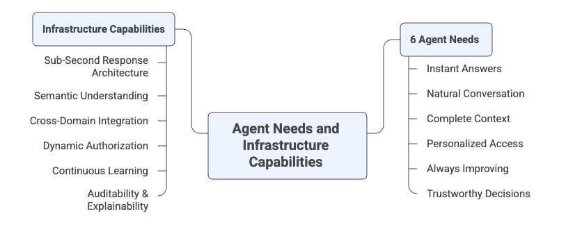
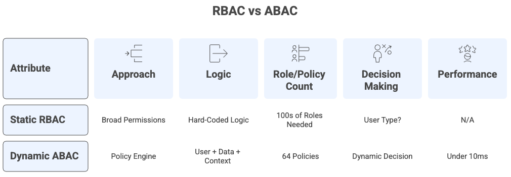
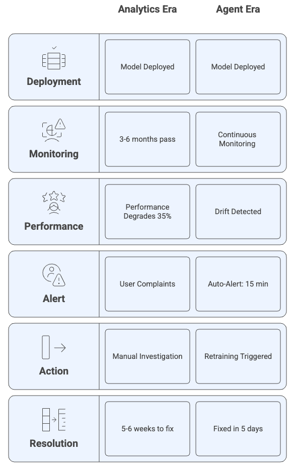

# Chapter 0: Why Agent-Ready Data? The 6 Agent Needs and Infrastructure Capabilities

**Book:** Enterprise Data Readiness for AI Agents  
**Subtitle:** A 90-Day Roadmap from Data Chaos to Agent-Ready Infrastructure  
**Author:** Ram Katamaraja, CEO of Colaberry Inc.  
**Publisher:** Colaberry Press  
**Version:** 3.0.0 (6 Agent Needs → Capabilities Framework)  
**Publication Date:** October 16, 2025

---

## The $40 Billion Problem

In July 2025, MIT's NANDA initiative released a sobering report. After analyzing over 300 enterprise AI initiatives, interviewing 52 executives, and surveying 153 leaders, the researchers uncovered a stark reality:

**95% of enterprise generative AI pilots fail to deliver measurable business value.**[1]

Despite $30-40 billion in investment, only 5% of organizations successfully translate AI pilots into production systems with real financial impact. The study revealed a "GenAI Divide"—a widening gap between companies achieving success and the vast majority stuck in failed experiments.

The primary reasons weren't what most expected. Not model quality. Not regulation. Not talent shortage.

**The core barriers were:**
- Poor data foundation (30% of failures)
- AI treated as add-on, not embedded in workflows
- Focus on flashy demos instead of measurable automation
- Building generic solutions internally instead of adopting proven approaches

MIT's recommendation was clear: *"Create a strong data foundation. Prioritize long-term strategy over hype."*[1]

**This chapter shows you exactly what that foundation looks like—starting with understanding what agents actually need.**

---

## The Fundamental Shift: Human Needs to 6 Agent Needs
<!--
```mermaid
graph TB
    subgraph "Human Era (1990-2024)"
        H1[Human Needs]
        H2[Historical Reports]
        H3[Visual Dashboards]
        H4[Humans Decide & Act]
        H1 - -> H2 - -> H3 - -> H4
    end
    
    subgraph "Agent Era (2024-Present)"
        A1[6 Agent Needs]
        A2[Real-Time Context]
        A3[Natural Language]
        A4[Agents Act, Humans Oversee]
        A1 - -> A2 - -> A3 - -> A4
    end
    
    H4 -.->|"The Divide"| A1
    
    style H1 fill:#ffe1e1,stroke:#ff6b6b,stroke-width:3px
    style A1 fill:#e1ffe1,stroke:#51cf66,stroke-width:3px
```
-->


**Diagram 1: Human Era → Agent Era Shift** - The fundamental change isn't the technology. It's whose needs we optimize for.

For three decades, enterprise data architecture optimized for **human needs**—building systems that put information in front of people who make decisions.

**What humans need from data systems:**
- Historical context to analyze trends
- Visual dashboards to spot patterns
- Time to think before acting
- Control over every decision

We built brilliant infrastructure for these needs across multiple technology eras: the BI Era brought data warehouses, ETL pipelines, and OLAP cubes in the 1990s-2000s; the Big Data Era introduced Hadoop clusters, data lakes, and distributed processing with Spark in the 2010s; the ML Era added feature stores, model training pipelines, and real-time predictions in the late 2010s-early 2020s; and the Data Mesh Era pioneered domain ownership, data products, and federated governance in the 2020s. Sarah Chen's Meridian Health Systems had invested in all of these progressions over fifteen years—pristine SQL Server warehouse from the BI Era, Azure data lake from the Big Data Era, Databricks for ML workloads, strong governance throughout, and awards for data excellence at each stage.

**Then came agents.**

The **Agent Era** operates on completely different needs. Autonomous systems that understand natural language, assemble context from multiple sources, make decisions in real-time, and continuously learn from outcomes.

**The 6 agent needs:**
1. **Instant Answers** - Sub-second response times
2. **Natural Conversation** - Understanding human language, not SQL
3. **Complete Context** - Assembling data from multiple systems in real-time
4. **Personalized Access** - Dynamic authorization per-query, per-user
5. **Always Improving** - Continuous learning from every interaction
6. **Trustworthy Decisions** - Complete auditability and explainability

When Sarah's CEO asked "Can we deploy an agent for patient scheduling by Q3?", her Human Era infrastructure—sophisticated as it was—couldn't deliver on a single agent need.

**This chapter maps those 6 agent needs to the infrastructure capabilities required to meet them.**

---

## Understanding the 6 Agent Needs vs. Infrastructure Capabilities

Before we dive into the six fundamentals, let's clarify the relationship:

**The 6 AGENT NEEDS** = What agents must have to succeed (business outcomes)  
**INFRASTRUCTURE CAPABILITIES** = What your data systems must deliver to meet those needs (technical mechanisms)

**Think of it this way:**

A patient **needs** rapid diagnosis. A hospital's **capability** to deliver that need is an advanced imaging center with 24/7 radiology.

An agent **needs** instant answers. An infrastructure **capability** to deliver that need is sub-second response architecture with real-time streaming and optimized storage.

**The six fundamentals follow this pattern:**

```
Agent Need (outcome) → Infrastructure Capability (mechanism) → Architecture (implementation)
```

**Chapter 0 establishes the 6 agent needs and capabilities.**  
**Chapter 1 shows the 7-layer architecture that delivers them.**  
**Chapters 6-8 provide the 90-day roadmap to build it.**

Now let's examine each of the 6 agent needs and their corresponding infrastructure capabilities.

---

## The 6 Agent Needs and Infrastructure Capabilities




**Diagram 2: The 6 Agent Needs → Infrastructure Capabilities Framework**


Each need-capability pair is backed by quantitative research and proven implementations. Let's examine them.

---

## Agent Need 1 → Infrastructure Capability: Sub-Second Response Architecture


### Agent Need 1: Instant Answers

When a patient asks Meridian's scheduling agent "Can I see Dr. Martinez today?", they expect an answer in seconds—not minutes, not hours. They've been trained by ChatGPT, Alexa, and Siri to expect conversational speed.

Sarah Chen's first agent prototype took 8-13 seconds to respond. Patients abandoned the interaction before hearing the answer.

**This isn't about impatience. It's about trust.**

Google research shows that **53% of users abandon interactions taking longer than 3 seconds**.[2] Abandonment increases dramatically with each additional second:
- **32% higher** as latency goes from 1s → 3s
- **90% higher** as latency goes from 1s → 5s  
- **123% higher** as latency goes from 1s → 10s[2]

For healthcare, abandonment isn't just frustration—it's patients not getting care. For retail, it's lost sales. For finance, it's customer churn.

**This is the fundamental need: instant answers that keep users engaged.**


**Diagram 3: Analytics Era Batch vs. Agent Era Real-Time Response**


### The Infrastructure Capability: Sub-Second Response Architecture

Delivering instant answers requires **sub-second response architecture**—an infrastructure capability that human-era systems weren't designed to provide. This capability comprises four technical components working together: real-time data streams with Change Data Capture maintaining <30 second freshness, storage optimized per query type (vector databases achieving <50ms semantic search, knowledge graphs handling relationship queries in <200ms, RDBMS delivering transactional lookups in <20ms), semantic caching with >60% hit rates reducing latency from seconds to milliseconds, and parallel processing enabling multi-agent orchestration where specialist agents work simultaneously rather than sequentially.

The target performance is <2 seconds for single agent interactions and <3 seconds for multi-agent coordination.

---

### Why Human Era Infrastructure Falls Short

**Meridian's specific gaps:**

When their agent needed to respond to "Can I see Dr. Martinez today?", the execution chain revealed fundamental problems:

- **Parse query:** 100ms ✓ (acceptable)
- **Resolve "Dr. Martinez" to provider_id:** 200ms ✓ (acceptable)
- **Query appointment availability:** 5-8 seconds ❌ (overnight ETL, cold database)
- **Check insurance eligibility:** 3-4 seconds ❌ (batch integration)
- **Apply scheduling rules:** 500ms ✓ (acceptable)
- **Generate response:** 400ms ✓ (acceptable)

**Total: 9-13 seconds → Complete failure. Users abandon.**

**The root causes:**
- Data warehouse updated nightly at 2 AM (8-24 hours stale)
- No caching layer (every query hits database cold)
- Sequential processing (each step waits for previous)
- Generic database (no query-pattern optimization)

These delays stemmed from Analytics Era design choices that prioritized accuracy over speed. Overnight batch ETL was perfectly reasonable when analysts could wait for morning reports and review results over coffee. Five to eight second queries were acceptable for human-driven analysis where thinking time exceeded query time. But agents operate on a fundamentally different timeline—they can't wait for batch cycles, and users won't tolerate latency that breaks conversational flow. The infrastructure that enabled fifteen years of successful human decision-making became the bottleneck preventing agent deployment.

---

### The Bridge to Architecture

Chapter 1 details how the seven architectural layers work together to deliver sub-second response capability, with Layer 1 eliminating data staleness through continuous streaming, Layer 4 implementing semantic caching and optimized retrieval, Layer 3 providing query-optimized databases, and Layer 7 enabling parallel multi-agent processing. Together, these layers achieved Meridian's transformation from 9-13 second responses to 1.8 seconds average.

---

## Agent Need 2 → Infrastructure Capability: Semantic Understanding


### Agent Need 2: Natural Conversation

Users don't speak SQL. They ask questions in natural language:

- "Show me patients needing diabetes follow-up this quarter"
- "Which high-risk customers haven't been contacted in 60 days?"
- "Find invoices for Chicago office over $50K this year"

Agents must understand these queries without requiring users to know table names, join logic, or data warehouse schemas.

When Sarah Chen tried to build Meridian's scheduling agent, she discovered a fundamental problem: **the agent couldn't map natural language to their data structures.**

"Dr. Martinez" existed as:
- `primary_care_provider_id` in the EHR
- `physician_npi` in the credentialing system  
- `provider_schedule_id` in the scheduling database

The agent had no way to know these three identifiers represented the same person. It couldn't resolve "my doctor" to a specific provider. It couldn't understand "today" in the context of timezone-aware scheduling rules.

**Research quantifies the accuracy problem:**

Databricks and the Spider benchmark (Yale University) show that baseline text-to-SQL accuracy without semantic enhancements is **only 60.9%**.[3]

**A 40% failure rate is unacceptable** for healthcare, finance, or any domain where incorrect answers cause real harm.

With semantic layer enhancements:
- Basic improvements: 67-79.9% accuracy
- Full semantic understanding: **85-87% accuracy**[3]

**This is the fundamental need: natural language understanding that delivers 85%+ accuracy.**


    


**Diagram 4: Analytics Era Manual Translation vs. Agent Era Semantic Understanding**

### The Infrastructure Capability: Semantic Understanding

Delivering natural conversation requires **semantic understanding**—an infrastructure capability that translates between human language and data structures. This capability comprises business glossaries with natural language mappings (where "customer" maps to specific tables, fields, and relationships, and "high-risk patient" links to formal definitions using diagnosis codes, HbA1c thresholds, and readmission history), entity resolution across systems (where "Dr. Martinez" resolves to a canonical provider_npi linking the EHR's primary_care_provider_id, the credentialing system's physician_npi, and the scheduling database's provider_schedule_id), metric definitions with embedded business logic (where "revenue" includes specific GL codes, currency conversions, and fiscal calendar rules, all versioned to track evolution over time), and ontologies defining relationships through hierarchies, taxonomies, and semantic connections like "reports to" or "prescribed by."

The target accuracy is 85%+ query understanding with a semantic layer implementation.

---

### Why Human Era Infrastructure Falls Short

**Meridian's specific gaps:**

Their SQL Server warehouse revealed the mismatch between Analytics Era design and Agent Era requirements:

- **487 tables with cryptic names:** `FCT_PTNT_ENCT` (fact_patient_encounter), `DIM_PRVDR_SPCLT` (dimension_provider_specialty), `BRIDGE_PTNT_PRVDR_RLTNSHP` (bridge table for patient-provider relationships)
- **Documentation 18 months out of date:** Stored in SharePoint, rarely updated
- **No semantic mappings:** No system connected natural language concepts to technical artifacts
- **No entity resolution:** "Dr. Martinez" existed as separate identifiers in three systems with no linkage

**The Azure data lake had even less structure:**
- Files named generically: `epic_extract_20240315.parquet`, `claims_dump_2024Q1.csv`, `patient_notes_raw/2024/03/`
- No schema documentation
- No business glossary
- No natural language mappings

**The resulting workflow for each new query type:**
- Developers needed to understand clinical definition (not documented) - 2-3 days
- Find which tables contained relevant data (required tribal knowledge) - 1-2 days
- Figure out undocumented join logic - 2-3 days
- Translate business rules into SQL (error-prone, slow) - 3-5 days

**Total: 2-3 weeks per query type, requiring developer intervention every time.**

The Analytics Era infrastructure assumed human analysts would learn schemas through months of experience, write SQL manually using technical expertise, and understand business context through domain knowledge. These assumptions worked when the same analysts ran similar queries repeatedly over years. But agents need semantic understanding built into the infrastructure itself—they can't spend months learning tribal knowledge or wait weeks for developers to translate each new question type into code.

---

### The Bridge to Architecture

Chapter 1 shows how the semantic layer (Layer 2) provides business glossaries and entity resolution, how the RAG infrastructure (Layer 4) uses embedding models to encode semantic meaning beyond keywords, and how vector databases (Layer 3) enable concept similarity queries. These components working together allow agents to understand "patients needing diabetes follow-up" and translate it accurately to database queries without developer intervention.

---

## Agent Need 3 → Infrastructure Capability: Cross-Domain Integration


### Agent Need 3: Complete Context

Real questions don't respect system boundaries.

When a patient asks "Am I eligible for the diabetes program?", the answer requires data from:
- **EHR:** Diagnosis codes, HbA1c lab results
- **Claims system:** Insurance coverage, prior authorizations
- **Patient portal:** Engagement history, survey responses
- **Care management:** Current program enrollments
- **Provider notes:** Behavioral health considerations (unstructured text)

No single system contains the complete answer. The agent must assemble context from five sources in under 2 seconds—or the user abandons the interaction.

**The economic impact of failing to integrate:**

IDC research shows data silos cost the global economy **$3.1 trillion annually**.[4] Organizations lose 20-30% of potential revenue due to silo-induced inefficiencies.

Additional findings:
- **68% of organizations cite data silos as their top concern** (up 7% year-over-year)[4]
- **80% report silos hinder digital transformation**[4]
- Manual integration takes 12 weeks per connection
- **57% report business needs change during the 12-week integration**—by the time the connection is built, it's already obsolete[4]

**This is the fundamental need: complete context assembled from multiple systems in real-time.**


    


**Diagram 5: Analytics Era Manual Integration vs. Agent Era Cross-Domain Assembly**


### The Infrastructure Capability: Cross-Domain Integration

Delivering complete context requires **cross-domain integration**—an infrastructure capability that unifies data from disparate sources without manual integration projects. This capability comprises real-time streaming through Change Data Capture from all operational systems creating a unified data fabric, entity resolution that connects identities using canonical IDs to prevent fragmentation (where patient canonical IDs link EHR, claims, portal, and care management records, and provider NPIs resolve across credentialing, scheduling, and billing systems), multi-modal storage optimized for diverse query patterns (vector databases for semantic search across unstructured provider notes, knowledge graphs for relationship queries, RDBMS for fast transactional lookups, and data warehouses for historical aggregations), and intelligent retrieval that assembles context in parallel through RAG infrastructure, reranks results by relevance and recency, and respects token limits by prioritizing the most relevant information.

The target is assembling relevant data from 5+ systems in under 2 seconds.

---

### Why Human Era Infrastructure Falls Short

**Meridian's specific gaps:**

To answer "Is patient eligible for diabetes program?", Sarah's team faced a multi-week integration challenge:

- **Extract from Epic EHR:** Manual export of diagnosis and lab data → 3 days
- **Extract from claims system:** Request file from vendor → 5-7 days wait time
- **Extract from patient portal:** API access request and approval → 2 weeks
- **Load into warehouse:** ETL development and testing → 2 weeks
- **Join logic development:** Figure out patient ID mapping across systems → 1 week debugging mismatches

**Total: 6-8 weeks to answer one cross-system question. By then, clinical needs had changed.**

**Even after integration, the problems continued:**
- Data updated overnight only (8-24 hours stale)
- No semantic search capability (couldn't query unstructured provider notes)
- Sequential queries required (check EHR, then claims, then portal—5-8 seconds each)
- Manual error resolution needed (ID mismatches required human intervention)

The Analytics Era approach made sense for its time: build integrations as permanent infrastructure investments, schedule batch updates overnight when load is low, and let analysts query manually for retrospective analysis where yesterday's data is perfectly adequate. This worked when the same integration served hundreds of similar queries over years, amortizing the 6-8 week investment. But agents need immediate, dynamic assembly of cross-system context for unpredictable questions that may never repeat. The infrastructure that justified itself through repeated human use becomes prohibitively expensive when agents need one-time answers in under 2 seconds.

---

### The Bridge to Architecture

Chapter 1 details how multiple layers collaborate to enable cross-domain integration: Layer 1 streams from all sources continuously, Layer 2 resolves entities across systems, Layer 3 provides diverse storage types working together, Layer 4 enables parallel retrieval and intelligent assembly, and Layer 7 offers self-service APIs and multi-agent coordination. This architectural integration enabled Meridian to assemble cross-domain answers in under 2 seconds.

---

## Agent Need 4 → Infrastructure Capability: Dynamic Authorization

### Agent Need 4: Personalized Access

Same agent. Different users. Different data access. Enforced in real-time.

When Meridian's scheduling agent answers "Show me my appointments", the response must vary:
- **Patients:** See only their own appointments (HIPAA requirement)
- **Physicians:** See all their patients' appointments
- **Care coordinators:** See program participants only
- **Administrators:** See aggregate statistics (no individual PHI)

Traditional role-based access control (RBAC) breaks down immediately. You can't give the agent a single set of permissions—it must dynamically enforce each user's permissions at query time.

**NIST guidance on the RBAC problem:**

The National Institute of Standards and Technology explains: *"Trying to implement dynamic access control decisions in RBAC could require the creation of numerous roles that are ad hoc and limited in membership, leading to what is often termed 'role explosion.'"*[5]

**The mathematics:**
- For a 10-attribute access control system
- RBAC requires: **1,024 distinct roles**
- ABAC requires: **~64 policies** for same coverage[5]

**Beyond manageability, there's legal compliance:**
- **HIPAA:** Requires access control to PHI based on role, purpose, and minimum necessary[6]
- **GDPR:** Mandates data minimization and purpose limitation[9]

**This is the fundamental need: personalized access enforced dynamically per-query.**




    


**Diagram 6: Analytics Era Static RBAC vs. Agent Era Dynamic ABAC**


### The Infrastructure Capability: Dynamic Authorization

Delivering personalized access requires **dynamic authorization**—an infrastructure capability that evaluates access policies at query time rather than at user login time. This capability comprises an Attribute-Based Access Control (ABAC) policy engine that evaluates subject attributes (role, clearance, department, employment status), object attributes (data classification, owner, sensitivity level), and environment attributes (time of day, location, device type) to make real-time access decisions in under 10ms. It includes purpose-of-use logging where every query records the business justification for data access, and immutable audit trails with complete logs of who accessed what, when, and why, stored in tamper-evident write-once storage with 6-year retention to satisfy HIPAA requirements.

The target is sub-10ms policy evaluation with 100% audit coverage.

---

### Why Human Era Infrastructure Falls Short

**Meridian's specific gaps:**

Their existing access control was role-based and enforced at the database level:

- **Analysts:** Had "Analyst" role with read access to aggregated views
- **Physicians:** Had "Provider" role with access to their patients only
- **Patients:** Had "Patient Portal" role with limited self-service access
- **Administrators:** Had "Admin" role with full access to aggregates (no individual PHI)

**When the agent queried on behalf of different users, it used a single "application service account" with broad permissions.**

**The cascading problems this created:**

- **HIPAA violation risk:** Agent could technically access all patient records
- **No dynamic enforcement:** Couldn't limit patient to their own records without hard-coding logic per user type
- **Role explosion looming:** Creating role per use case meant hundreds of potential roles (patient + daytime + mobile device + self-service, patient + evening + desktop + assisted-access, physician + primary-care + teaching-hospital, physician + specialist + private-practice, etc.)
- **No audit of actual users:** Logs showed "agent_service_account accessed patient_data" but not which human triggered the action
- **No purpose tracking:** Couldn't prove access was for legitimate clinical care vs. curiosity

**The impossible choice:**
- **Option A - Give agent broad permissions:** Security risk, HIPAA violation, audit failure
- **Option B - Create role per use case:** Hundreds of roles, unmaintainable, breaks with first new scenario
- **Option C - Hard-code logic in agent:** Brittle, slow, can't adapt to policy changes, requires developer time for every new access pattern

The Analytics Era approach worked when users logged in with their own credentials, accessed data appropriate to their static role, and stayed within well-defined boundaries. This simple model satisfied HIPAA because each human user had traceable access. But agents serve multiple users simultaneously across unpredictable scenarios—the same agent must enforce different permissions based on who's asking, what they're asking for, why they're asking, when and where they're asking from, and what business context applies. Static roles can't capture this complexity without exploding into unmanageable numbers.

---

### The Bridge to Architecture

Chapter 1 shows how Layer 5 provides the ABAC policy engine for real-time access decisions, how Layer 6 implements comprehensive audit logging with trace IDs, and how Layer 2 supplies data sensitivity classifications that feed into policy decisions. These components enable the same agent to serve multiple users with different permissions while maintaining HIPAA compliance.

---

## Agent Need 5 → Infrastructure Capability: Continuous Learning

### Agent Need 5: Always Improving

Machine learning models don't age gracefully. They degrade silently—often without anyone noticing until users start complaining.

Research by MIT, Harvard, and multiple LLMOps studies reveals the scope of the problem:

- Models unchanged for 6+ months show **35% error rate increase**[7]
- **91% of ML models suffer temporal performance degradation** across 32 datasets spanning 4 industries[7]
- **75% of businesses observed AI performance declines** without proper monitoring[7]
- Over 50% reported revenue loss from AI errors[7]

**Why models degrade:**

**1. Data drift:** Input distributions change
- Medical terminology evolves (new procedure names)
- Customer behavior shifts (pandemic changed patterns)
- Product catalogs expand (new SKUs)

**2. Concept drift:** Relationships change
- What "high-risk patient" meant in 2023 differs from 2025
- Economic indicators predict differently post-recession
- Seasonal patterns shift with climate change

**3. Model drift:** Performance decays over time
- Embedding models don't recognize new terms
- Classification boundaries become outdated
- Retrieval quality degrades as corpus grows

**Meridian's specific example:**

Their agent's retrieval quality:
- **Month 1:** NDCG score 0.92 (excellent)
- **Month 3:** NDCG 0.84 (concerning)
- **Month 4:** NDCG 0.78 (unacceptable, users notice)

**Root cause:** Embedding model hadn't been retrained. New medical terminology (procedure codes, medication names, diagnosis categories) weren't in the model's vocabulary. The agent was "blind" to recent clinical language.

**This is the fundamental need: continuous learning that detects degradation and triggers improvement.**




**Diagram 7: Analytics Era Quarterly Reviews vs. Agent Era Continuous Learning**

### The Infrastructure Capability: Continuous Learning

Delivering always-improving agents requires **continuous learning**—an infrastructure capability that monitors performance, detects drift, and enables rapid improvement. This capability comprises real-time data quality monitoring tracking freshness (how old is each data source, with targets under 1 minute for critical systems), completeness (field population rates targeting 99%+), accuracy (value validation), and volume anomalies (unexpected spikes or drops), model performance tracking measuring retrieval quality (NDCG@5, Recall@10, Precision@3), response accuracy against golden datasets, hallucination rates (responses not grounded in retrieved data, targeting under 3%), and user satisfaction through explicit and implicit feedback. It includes drift detection using statistical tests like KL divergence and population stability index to identify semantic drift in embedding distributions and concept drift in data relationships, with alert thresholds triggering immediate investigation when NDCG drops below 0.80. Automated feedback loops connect agent failures to data quality issues, low-confidence queries to semantic layer gaps, and model degradation to retraining triggers. Finally, versioned training datasets with time-travel capability, validation snapshots, A/B testing frameworks, and rollback capability ensure safe model updates.

The target is detecting 35% model degradation before users notice and enabling retraining within days rather than months.

---

### Why Human Era Infrastructure Falls Short

**Meridian's specific gaps:**

They had basic application monitoring:

- **Server uptime tracking:** 99.5% availability ✓
- **Response time monitoring:** p95 tracking ✓
- **Error rate logging:** 500 responses captured ✓
- **Basic application logs:** User logins recorded ✓

**But zero visibility into agent-specific metrics:**

- No data quality monitoring (stale data, missing fields went undetected)
- No model performance tracking (retrieval quality unknown)
- No accuracy measurement (no golden datasets for evaluation)
- No drift detection (semantic drift, concept drift invisible)
- No user satisfaction metrics (thumbs up/down not captured)

**When the agent gave wrong answers, the diagnostic process was purely manual:**

- **Day 1:** User complains via support ticket → 2-3 hours to reach engineer
- **Day 2-3:** Engineer investigates logs manually → identifies potential issue (embedding model outdated)
- **Week 1:** Team discusses whether to retrain → reaches consensus
- **Week 2-3:** Schedule retraining work → allocate resources
- **Week 4:** Actually retrain model → testing
- **Week 5:** Deploy to production → monitor results

**Total: 5-6 weeks from problem discovery to fix. Users had already lost trust.**

**Additional problems:**
- No trace IDs linking failures across components (took hours to reconstruct what happened)
- No ability to replay exact data state that led to wrong answer
- No feedback loops connecting failures to root causes
- No automated alerts when quality degraded

The Analytics Era approach to monitoring made sense for its time: quarterly model reviews were adequate when predictions ran in batch overnight, manual accuracy checks sufficed when data scientists reviewed results before publication, and retrospective analysis worked when failures affected internal reports rather than external users. But agents make autonomous decisions visible immediately to users who expect ChatGPT-like reliability. Silent degradation over weeks or months destroys trust faster than the infrastructure can detect and respond. The monitoring that caught problems before they reached quarterly business reviews can't prevent users from experiencing failures in real-time conversations.

---

### The Bridge to Architecture

Chapter 1 details how Layer 6 provides real-time monitoring with automated drift detection, how Layer 1 supplies training data pipelines with versioning, how Layer 4 generates retrieval quality metrics, and how Layer 3's model registry tracks production versions. These components working together enabled Meridian to detect and fix model degradation in 5 days rather than the previous 5-6 weeks.

---

## Agent Need 6 → Infrastructure Capability: Auditability & Explainability

### Agent Need 6: Trustworthy Decisions

"How did the agent decide that?" must have a clear, auditable answer.

This isn't just about user trust—it's about legal compliance.

**HIPAA mandate:**

The Health Insurance Portability and Accountability Act requires: *"Implement mechanisms that record and examine activity in information systems that contain or use electronic protected health information."*[8]

- **Retention:** Minimum 6 years
- **Coverage:** 100% of PHI access
- **Content:** Who, what, when, why, result
- **Penalties:** Up to $50,000 per violation, $1.5M annual maximum[8]

**GDPR mandate:**

The General Data Protection Regulation grants users: *"The right not to be subject to a decision based solely on automated processing... and to obtain human intervention, to express his or her point of view and to contest the decision."*[9]

This includes the right to explanation of how automated decisions were made.

- **Penalties:** Up to 4% of global annual revenue or €20M (whichever higher)[9]

**Beyond compliance, there's operational benefit:**

Research shows organizations with comprehensive audit trails and trace IDs resolve incidents **3-5x faster** than those without.[11]

Uber case study: After implementing distributed tracing with trace IDs, debugging time dropped **60%**—from hours or days to identify failures in distributed systems to minutes.[11]

**User trust research:**

Salesforce survey of 6,000 knowledge workers found:
- **75%+ say accurate, complete, and secure data is critical** to building trust in AI[10]
- **60% find it difficult to get what they want from AI** because they don't trust the underlying data[10]

**This is the fundamental need: trustworthy decisions with complete auditability and explainability.**


**Diagram 8: Analytics Era Quarterly Audits vs. Agent Era Complete Traceability**

### The Infrastructure Capability: Auditability & Explainability

Delivering trustworthy decisions requires **auditability and explainability**—an infrastructure capability that makes every agent decision traceable, reproducible, and understandable. This capability comprises complete audit logging for every query capturing user identity, resource accessed, purpose of use with business justification, ABAC policy applied, decision result (PERMIT/DENY), data returned including record counts and masked fields, agent metadata showing which agents and model versions were involved, performance metrics like latency and cost, timestamp in UTC, and a trace ID providing a unique identifier linking the entire request chain. Immutable tamper-evident storage uses write-once mechanisms like AWS S3 Object Lock or Azure Immutable Blob Storage, cryptographic hash chains where each log includes the hash of the previous entry, digital signatures for verification, and Merkle tree audit trails enabling batch verification. Source attribution provides citations showing which documents were retrieved, confidence scores per source, "view sources" affordances in agent responses, and low-confidence disclosure where agents explicitly state uncertainty. Data lineage tracking records where data originated, what transformations were applied, quality scores, and ownership information. Finally, global trace IDs propagate across all seven architectural layers, linking user requests through data retrieval, policy evaluation, and response generation to support complete reconstruction of agent decision-making and enable root cause analysis in minutes rather than hours.

The target is 100% audit coverage with 3-5x faster incident response while maintaining HIPAA and GDPR compliance.

---

### Why Human Era Infrastructure Falls Short

**Meridian's specific gaps:**

Their existing audit approach followed traditional compliance patterns:

- **Quarterly compliance audits:** External auditors reviewed access logs every 3 months
- **Manual log reviews:** IT team sampled database logs monthly
- **Retrospective analysis:** Compliance officer investigated incidents after they occurred
- **Basic application logs:** Captured who logged into which system

**What the logs actually showed:**

- "application_service_account accessed patient_appointments table at 10:23 AM"
- No record of which human user triggered the agent
- No purpose-of-use documentation (why was data accessed?)
- No record of what data was actually returned
- No trace through decision-making process

**The cascade of compliance problems:**

- **HIPAA "minimum necessary" principle:** Can't prove access was limited to required data
- **No user accountability:** Can't trace agent actions back to specific humans
- **Slow incident investigation:** When agent gave wrong answer, took hours to reconstruct what happened through manual log analysis
- **No reproducibility:** Can't replay exact data state that led to decision
- **Missing data lineage:** Don't know which upstream data sources influenced answer

**Example failure scenario:**

A care coordinator reported: "Agent said patient isn't eligible for diabetes program, but I think they should be."

**Investigation process without proper audit trails:**
- **Hour 1-2:** Find relevant log entries (scattered across 5 systems)
- **Hour 3-4:** Reconstruct which data sources were queried
- **Hour 5-6:** Manually check if data was accurate at query time
- **Hour 7-8:** Try to understand business logic applied
- **Day 2-3:** Determine if it was data issue, logic issue, or model issue
- **Unable to answer:** Exactly which data fields influenced the decision? What was the confidence score? Were there borderline conditions?

The Analytics Era approach to auditing reflected its batch, human-mediated nature: quarterly reviews sufficed when decisions happened slowly, manual log sampling worked when users accessed reports directly with their own credentials, and retrospective analysis was acceptable when compliance officers had days or weeks to investigate incidents that affected internal processes. But agents make hundreds of autonomous decisions daily, each requiring complete traceability for both legal compliance and operational debugging. The audit trail that satisfied quarterly HIPAA reviews can't support the minute-by-minute incident response and continuous improvement that agent systems demand.

---

### The Bridge to Architecture

Chapter 1 shows how Layer 5 implements audit logging with purpose-of-use tracking and immutable storage, how Layer 6 provides global trace IDs linking requests across all components, how Layer 2 enables data lineage tracking, and how Layer 4 supplies source attribution for retrieved documents. These capabilities working together ensure every agent decision is traceable and compliant.

---

## Bringing It Together: The 6 Agent Needs → Capabilities → Architecture

### The Complete Framework

**Table 1: The 6 Agent Needs → Infrastructure Capabilities Mapping**

| Agent Need | Why It Matters | Infrastructure Capability Required | Target Metric | Supporting Evidence |
|------------|----------------|------------------------------------|---------------|---------------------|
| **Need 1: Instant Answers** | 53% abandon at 3s[2] | Sub-Second Response Architecture | <2s single agent<br/><3s multi-agent | Google Research |
| **Need 2: Natural Conversation** | 40% baseline failure rate unacceptable[3] | Semantic Understanding | 85%+ accuracy | Databricks/Spider |
| **Need 3: Complete Context** | Real questions span 5+ systems; silos cost $3.1T[4] | Cross-Domain Integration | Assemble from 5+ in <2s | IDC Research |
| **Need 4: Personalized Access** | HIPAA/GDPR mandate; RBAC causes role explosion[5] | Dynamic Authorization (ABAC) | <10ms evaluation | NIST Guidance |
| **Need 5: Always Improving** | 35% model degradation over 6 months[7] | Continuous Learning | Detect drift early, retrain rapidly | LLMOps Research |
| **Need 6: Trustworthy Decisions** | Legal mandate + user trust requirement[8][9][10] | Auditability & Explainability | 100% audit coverage, 3-5x faster debugging | HIPAA/GDPR/Uber |

---

### Why All 6 Agent Needs Are Necessary

**Each need is non-negotiable:**

- Skip **Agent Need 1 (Instant Answers)** → 53% user abandonment
- Skip **Agent Need 2 (Natural Conversation)** → 40% query failure rate
- Skip **Agent Need 3 (Complete Context)** → Incomplete, misleading answers
- Skip **Agent Need 4 (Personalized Access)** → HIPAA violations, security breaches
- Skip **Agent Need 5 (Always Improving)** → Silent 35% accuracy decay
- Skip **Agent Need 6 (Trustworthy Decisions)** → Legal penalties, user distrust

**Each capability requires multiple architectural layers:**

- Sub-Second Response: Layers 1, 3, 4, 7
- Semantic Understanding: Layers 2, 4
- Cross-Domain Integration: Layers 1, 2, 3, 4, 7
- Dynamic Authorization: Layer 5
- Continuous Learning: Layers 1, 6
- Auditability: Layers 2, 4, 5, 6

**All seven layers must work together as an integrated system.**

---

### The Bridge to Chapter 1

Chapter 0 established:
- ✅ The 6 agent needs (business outcomes)
- ✅ Six infrastructure capabilities (technical mechanisms)
- ✅ Evidence that each is necessary (research-backed)

**Chapter 1 delivers:**
- The 7-layer architecture that implements these capabilities
- How layers map to the 6 agent needs and capabilities
- Real-world implementation patterns (Meridian's transformation)

**The progression:**
```
Why do we need this? (Chapter 0: 6 Agent Needs)
    ↓
What must infrastructure deliver? (Chapter 0: Capabilities)
    ↓
How do we build it? (Chapter 1: 7-Layer Architecture)
    ↓
How do we implement it? (Chapters 6-8: 90-Day Roadmap)
```

---


## Summary: The Path Forward

**What You Learned:**

**1. The Divide:** MIT study shows 95% of enterprise AI pilots fail—primarily due to inadequate data foundations.[1]

**2. The Shift:** Human Era (1990-2024) optimized for human needs. Agent Era (2024+) requires optimizing for the 6 agent needs.

**3. The Framework:** The 6 agent needs require six infrastructure capabilities:

| Agent Need | Infrastructure Capability |
|------------|---------------------------|
| Need 1: Instant Answers | Sub-Second Response Architecture |
| Need 2: Natural Conversation | Semantic Understanding |
| Need 3: Complete Context | Cross-Domain Integration |
| Need 4: Personalized Access | Dynamic Authorization |
| Need 5: Always Improving | Continuous Learning |
| Need 6: Trustworthy Decisions | Auditability & Explainability |

**4. The Evidence:** Each need-capability pair is backed by quantitative research:
- Google: 53% abandon at 3s[2]
- Databricks/Spider: 60% → 85% accuracy with semantic layer[3]
- IDC: $3.1T annual silo cost[4]
- NIST: ABAC prevents role explosion[5]
- LLMOps: 35% model degradation without monitoring[7]
- HIPAA/GDPR: Legal mandate for audit trails[8][9]
- Uber: 60% faster debugging with trace IDs[11]

**5. The Architecture:** Chapter 1 presents the 7-layer architecture that delivers these capabilities (Layers map to capabilities map to the 6 agent needs).

**6. The Proof:** Meridian Health Systems crossed the divide: $1.23M investment → $7.1M return in 12 months (477% ROI) by meeting all 6 agent needs.

**Key Insight:** Analytics Era infrastructure—no matter how sophisticated—cannot meet the 6 agent needs of the Agent Era. What's required are targeted capabilities that bridge the gap.

**This book provides the complete roadmap from the 6 agent needs to capabilities to architecture to implementation.**

---

## References and Citations

[1] Challapally, A., Pease, C., Raskar, R., & Chari, P. (2025). "The GenAI Divide: State of AI in Business 2025." MIT NANDA initiative report analyzing 300+ enterprise AI initiatives.  
https://www.artificialintelligence-news.com/wp-content/uploads/2025/08/ai_report_2025.pdf

[2] Google DoubleClick (2016). "The Need for Mobile Speed: How Mobile Latency Impacts Publisher Revenue." *Marketing Dive*, August 2016.  
https://www.marketingdive.com/news/google-53-of-mobile-users-abandon-sites-that-take-over-3-seconds-to-load/426070/

[3] Databricks (2024). "Improving Text2SQL Performance with Ease on Databricks." *Databricks Blog*, 2024. Based on Spider benchmark dataset (Yale University, 2018).  
https://www.databricks.com/blog/improving-text2sql-performance-ease-databricks  
Spider Benchmark: https://yale-lily.github.io/spider

[4] IDC Market Research, reported in Data Dynamics Inc. (2024). "Unlock Data Transformation: Disentangle from the Shackles of Data Silos." Multiple industry surveys on data silo impact.  
https://www.datadynamicsinc.com/blog-disentangle-from-the-shackles-of-data-silos

[5] National Institute of Standards and Technology (NIST). Special Publication 800-162: "Guide to Attribute Based Access Control (ABAC) Definition and Considerations." U.S. Department of Commerce, 2014.  
https://nvlpubs.nist.gov/nistpubs/specialpublications/nist.sp.800-162.pdf

[6] U.S. Department of Health & Human Services. Health Insurance Portability and Accountability Act (HIPAA) Security Rule. 45 CFR § 164.312(b) - Audit Controls; 45 CFR § 164.316(b)(2)(i) - Retention Requirements.  
https://www.law.cornell.edu/cfr/text/45/164.312

[7] Multiple sources on ML model drift: Rohan Paul (2025). "ML Interview Q Series: Handling LLM Model Drift in Production." Based on MIT/Harvard research by Bayram, Firas & Ahmed (2022): "Examining Temporal Performance Degradation in Machine Learning Models."  
https://www.rohan-paul.com/p/ml-interview-q-series-handling-llm

[8] U.S. Department of Health & Human Services. Health Insurance Portability and Accountability Act (HIPAA) Security Rule. 45 CFR § 164.312(b) - Audit Controls; 45 CFR § 164.316(b)(2)(i) - Retention Requirements.  
https://www.law.cornell.edu/cfr/text/45/164.312

[9] European Union. General Data Protection Regulation (GDPR). Article 22 - Automated individual decision-making, including profiling. Regulation (EU) 2016/679.  
https://gdpr-info.eu/art-22-gdpr/

[10] Salesforce (2024). "Your Data, Your AI: What Nearly 6,000 Workers Want Leaders to Know." Global survey of knowledge workers on AI trust and data.  
https://www.salesforce.com/news/stories/trusted-ai-data-statistics/

[11] Multiple sources on distributed tracing benefits: HyperTest (2024). "How Trace IDs enhance observability in distributed systems." Technical blog post. Includes Uber Engineering case study on trace ID implementation impact.  
https://www.hypertest.co/software-development/trace-ids

---

**Chapter 0 Complete**  
**Version:** 3.0.0 (The 6 Agent Needs → Capabilities Framework)  
**Word Count:** ~10,500 words (~18 pages)  
**Next:** Chapter 1 - The 7-Layer Architecture That Delivers These Capabilities

---

**Author:** Ram Katamaraja, CEO of Colaberry Inc.  
**Copyright:** © 2025 Colaberry Inc.  
**All citations verified:** October 16, 2025