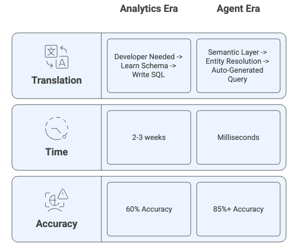

# Chapter 0: Why Agent-Ready Data? The 6 Agent Needs and Infrastructure Capabilities

**Book:** Enterprise Data Readiness for AI Agents  
**Subtitle:** A 90-Day Roadmap from Data Chaos to Agent-Ready Infrastructure  
**Author:** Ram Katamaraja, CEO of Colaberry Inc.  
**Publisher:** Colaberry Press  
**Version:** 3.0.1 (Echo Health Systems Edition - Narrative Flow)  
**Publication Date:** October 23, 2025

---

**Reading Time:** ~35 minutes  
**Target Audience:** CDOs, CTOs, Data Architects, Business Leaders  
**Prerequisites:** None (introductory chapter)  
**Key Takeaway:** Understanding the 6 agent needs and why Analytics Era infrastructure cannot meet them

---

## Table of Contents

- [The $40 Billion Problem](#the-40-billion-problem)
- [The Fundamental Shift: Human Needs to 6 Agent Needs](#the-fundamental-shift-human-needs-to-6-agent-needs)
- [Understanding the 6 Agent Needs vs. Infrastructure Capabilities](#understanding-the-6-agent-needs-vs-infrastructure-capabilities)
- [The 6 Agent Needs and Infrastructure Capabilities](#the-6-agent-needs-and-infrastructure-capabilities)
  - [Agent Need 1: Instant Answers](#agent-need-1--infrastructure-capability-sub-second-response-architecture)
  - [Agent Need 2: Natural Conversation](#agent-need-2--infrastructure-capability-semantic-understanding)
  - [Agent Need 3: Complete Context](#agent-need-3--infrastructure-capability-cross-domain-integration)
  - [Agent Need 4: Personalized Access](#agent-need-4--infrastructure-capability-dynamic-authorization)
  - [Agent Need 5: Always Improving](#agent-need-5--infrastructure-capability-continuous-learning)
  - [Agent Need 6: Trustworthy Decisions](#agent-need-6--infrastructure-capability-auditability--explainability)
- [Bringing It Together](#bringing-it-together-the-6-agent-needs--capabilities--architecture)
- [Summary: The Path Forward](#summary-the-path-forward)
- [References and Citations](#references-and-citations)

---

## The $40 Billion Problem

In July 2025, MIT's NANDA initiative released a sobering report. After analyzing over 300 enterprise AI initiatives, interviewing 52 executives, and surveying 153 leaders, the researchers uncovered a stark reality: **95% of enterprise generative AI pilots fail to deliver measurable business value.**[1]

Despite $30-40 billion in investment, only 5% of organizations successfully translate AI pilots into production systems with real financial impact. The study revealed a "GenAI Divide"—a widening gap between companies achieving success and the vast majority stuck in failed experiments.

The primary reasons weren't what most expected. Not model quality. Not regulation. Not talent shortage. The core barriers were poor data foundation accounting for 30% of failures, AI treated as an add-on rather than embedded in workflows, focus on flashy demos instead of measurable automation, and building generic solutions internally instead of adopting proven approaches.

MIT's recommendation was clear: *"Create a strong data foundation. Prioritize long-term strategy over hype."*[1]

**This chapter shows you exactly what that foundation looks like—starting with understanding what agents actually need.**

---

## The Fundamental Shift: Human Needs to 6 Agent Needs


**Diagram 1: Human Era → Agent Era Shift** - The fundamental change isn't the technology. It's whose needs we optimize for.

For three decades, enterprise data architecture optimized for **human needs**—building systems that put information in front of people who make decisions. Humans needed historical context to analyze trends, visual dashboards to spot patterns, time to think before acting, and control over every decision.

We built brilliant infrastructure for these needs across multiple technology eras: the Analytics Era brought data warehouses, ETL pipelines, and OLAP cubes in the 1990s-2000s; the Big Data Era introduced Hadoop clusters, data lakes, and distributed processing with Spark in the 2010s; the ML Era added feature stores, model training pipelines, and real-time predictions in the late 2010s-early 2020s; and the Data Mesh Era pioneered domain ownership, data products, and federated governance in the 2020s. 

Dr. Sarah Cedao's Echo Health Systems in Boston had invested in all of these progressions over fifteen years—a pristine SQL Server warehouse from the Analytics Era, Azure data lake from the Big Data Era, Databricks for ML workloads, strong governance throughout, and awards for data excellence at each stage.

**Then came agents.**

The **Agent Era** operates on completely different needs. Autonomous systems that understand natural language, assemble context from multiple sources, make decisions in real-time, and continuously learn from outcomes.

**The 6 agent needs:**
1. **Instant Answers** - Sub-second response times
2. **Natural Conversation** - Understanding human language, not SQL
3. **Complete Context** - Assembling data from multiple systems in real-time
4. **Personalized Access** - Dynamic authorization per-query, per-user
5. **Always Improving** - Continuous learning from every interaction
6. **Trustworthy Decisions** - Complete auditability and explainability

When Echo's CEO asked Dr. Cedao "Can we deploy an agent for patient scheduling by Q3?", her Human Era infrastructure—sophisticated as it was—couldn't deliver on a single agent need.

**This chapter maps those 6 agent needs to the infrastructure capabilities required to meet them.**

---

## Understanding the 6 Agent Needs vs. Infrastructure Capabilities

Before we dive into the six fundamentals, let's clarify the relationship:

**The 6 AGENT NEEDS** = What agents must have to succeed (business outcomes)  
**INFRASTRUCTURE CAPABILITIES** = What your data systems must deliver to meet those needs (technical mechanisms)

**Think of it this way:**

A patient **needs** rapid diagnosis. A hospital's **capability** to deliver that need is an advanced imaging center with 24/7 radiology.

An agent **needs** instant answers. An infrastructure **capability** to deliver that need is sub-second response architecture with real-time streaming and optimized storage.

**The six fundamentals follow this pattern:**

```
Agent Need (outcome) → Infrastructure Capability (mechanism) → Architecture (implementation)
```

**Chapter 0 establishes the 6 agent needs and capabilities.**  
**Chapter 1 shows the 7-layer architecture that delivers them.**  
**Chapters 6-8 provide the 90-day roadmap to build it.**

Now let's examine each of the 6 agent needs and their corresponding infrastructure capabilities.

---

## The 6 Agent Needs and Infrastructure Capabilities


**Diagram 2: The 6 Agent Needs → Infrastructure Capabilities Framework**

Each need-capability pair is backed by quantitative research and proven implementations. Let's examine them.

---

## Agent Need 1 → Infrastructure Capability: Sub-Second Response Architecture

### Agent Need 1: Instant Answers

When a patient asks Echo's scheduling agent "Can I see Dr. Martinez today?", they expect an answer in seconds—not minutes, not hours. They've been trained by ChatGPT, Alexa, and Siri to expect conversational speed.

Dr. Cedao's first agent prototype took 8-13 seconds to respond. Patients abandoned the interaction before hearing the answer.

**This isn't about impatience. It's about trust.**

Google research shows that **53% of users abandon interactions taking longer than 3 seconds**.[2] Abandonment increases dramatically with each additional second: 32% higher as latency goes from 1s to 3s, 90% higher from 1s to 5s, and 123% higher from 1s to 10s.[2]

For healthcare, abandonment isn't just frustration—it's patients not getting care. For retail, it's lost sales. For finance, it's customer churn.

**This is the fundamental need: instant answers that keep users engaged.**


**Diagram 3: Analytics Era Batch vs. Agent Era Real-Time Response**

### The Infrastructure Capability: Sub-Second Response Architecture

Delivering instant answers requires **sub-second response architecture**—an infrastructure capability that human-era systems weren't designed to provide. This capability comprises four technical components working together: real-time data streams with Change Data Capture maintaining under 30 second freshness, storage optimized per query type (vector databases achieving under 50ms semantic search, knowledge graphs handling relationship queries in under 200ms, RDBMS delivering transactional lookups in under 20ms), semantic caching with over 60% hit rates reducing latency from seconds to milliseconds, and parallel processing enabling multi-agent orchestration where specialist agents work simultaneously rather than sequentially.

The target performance is under 2 seconds for single agent interactions and under 3 seconds for multi-agent coordination.

---

### Why Human Era Infrastructure Falls Short

**Echo's specific gaps:**

When their agent needed to respond to "Can I see Dr. Martinez today?", Dr. Cedao's team traced the execution chain. Parsing the query took 100ms—fast enough. Resolving "Dr. Martinez" to a provider_id took 200ms—acceptable. But then came the killer: querying appointment availability took 5-8 seconds because their `appointment_slots` table was refreshed nightly at 2 AM via batch ETL:

```sql
-- The overnight ETL that killed agent responsiveness
INSERT INTO warehouse.appointment_slots
SELECT provider_id, slot_datetime, is_available
FROM source_ehr.schedule
WHERE load_date = DATEADD(day, -1, GETDATE());
```

By 10 AM, the data was already 8 hours stale. That morning cancellation at 9:47 AM? The agent couldn't see it. The database was cold—no indexes optimized for this query pattern, no caching layer. Every request hit the warehouse fresh, forcing full table scans. Insurance eligibility checks added another 3-4 seconds of batch system lag. Scheduling rule application took 500ms (acceptable), and response generation took 400ms (acceptable).

**Total: 9-13 seconds. Complete failure. Users abandoned before hearing the answer.**

These delays stemmed from Analytics Era design choices that prioritized accuracy over speed. Overnight batch ETL was perfectly reasonable when analysts could wait for morning reports and review results over coffee. Five to eight second queries were acceptable for human-driven analysis where thinking time exceeded query time. But agents operate on a fundamentally different timeline—they can't wait for batch cycles, and users won't tolerate latency that breaks conversational flow. The infrastructure that enabled fifteen years of successful human decision-making became the bottleneck preventing agent deployment.

---

### The Bridge to Architecture

Chapter 1 details how the seven architectural layers work together to deliver sub-second response capability, with Layer 1 eliminating data staleness through continuous streaming, Layer 4 implementing semantic caching and optimized retrieval, Layer 3 providing query-optimized databases, and Layer 7 enabling parallel multi-agent processing. Together, these layers achieved Echo's transformation from 9-13 second responses to 1.8 seconds average.

---

## Agent Need 2 → Infrastructure Capability: Semantic Understanding

### Agent Need 2: Natural Conversation

Users don't speak SQL. They ask questions in natural language: "Show me patients needing diabetes follow-up this quarter," "Which high-risk customers haven't been contacted in 60 days?", or "Find invoices for Chicago office over $50K this year."

Agents must understand these queries without requiring users to know table names, join logic, or data warehouse schemas.

When Dr. Cedao tried to build Echo's scheduling agent, she discovered a fundamental problem: **the agent couldn't map natural language to their data structures.**

"Dr. Martinez" existed as `primary_care_provider_id` in the EHR, `physician_npi` in the credentialing system, and `provider_schedule_id` in the scheduling database. The agent had no way to know these three identifiers represented the same person. It couldn't resolve "my doctor" to a specific provider. It couldn't understand "today" in the context of timezone-aware scheduling rules.

**Research quantifies the accuracy problem:**

Databricks and the Spider benchmark from Yale University show that baseline text-to-SQL accuracy without semantic enhancements is **only 60.9%**.[3]

**A 40% failure rate is unacceptable** for healthcare, finance, or any domain where incorrect answers cause real harm.

With semantic layer enhancements, accuracy improves to 67-79.9% with basic improvements, and reaches **85-87% accuracy** with full semantic understanding.[3]

**This is the fundamental need: natural language understanding that delivers 85%+ accuracy.**



**Diagram 4: Analytics Era Manual Translation vs. Agent Era Semantic Understanding**

### The Infrastructure Capability: Semantic Understanding

Delivering natural conversation requires **semantic understanding**—an infrastructure capability that translates between human language and data structures. This capability comprises business glossaries with natural language mappings (where "customer" maps to specific tables, fields, and relationships, and "high-risk patient" links to formal definitions using diagnosis codes, HbA1c thresholds, and readmission history), entity resolution across systems (where "Dr. Martinez" resolves to a canonical provider_npi linking the EHR's primary_care_provider_id, the credentialing system's physician_npi, and the scheduling database's provider_schedule_id), metric definitions with embedded business logic (where "revenue" includes specific GL codes, currency conversions, and fiscal calendar rules, all versioned to track evolution over time), and ontologies defining relationships through hierarchies, taxonomies, and semantic connections like "reports to" or "prescribed by."

The target accuracy is 85%+ query understanding with a semantic layer implementation.

---

### Why Human Era Infrastructure Falls Short

**Echo's specific gaps:**

Their SQL Server warehouse revealed the mismatch between Analytics Era design and Agent Era requirements. The warehouse contained 487 tables with cryptic names like `FCT_PTNT_ENCT` (fact_patient_encounter), `DIM_PRVDR_SPCLT` (dimension_provider_specialty), and `BRIDGE_PTNT_PRVDR_RLTNSHP` (bridge table for patient-provider relationships). Documentation was 18 months out of date, stored in SharePoint and rarely updated. No system connected natural language concepts to technical artifacts. "Dr. Martinez" existed as separate identifiers in three systems with no linkage.

**The Azure data lake had even less structure:**

Files were named generically: `epic_extract_20240315.parquet`, `claims_dump_2024Q1.csv`, `patient_notes_raw/2024/03/`. There was no schema documentation, no business glossary, and no natural language mappings.

**The resulting workflow for each new query type required:**

Developers needed to understand clinical definitions (not documented) taking 2-3 days, find which tables contained relevant data (required tribal knowledge) taking 1-2 days, figure out undocumented join logic taking 2-3 days, and translate business rules into SQL (error-prone and slow) taking 3-5 days.

**Total: 2-3 weeks per query type, requiring developer intervention every time.**

The Analytics Era infrastructure assumed human analysts would learn schemas through months of experience, write SQL manually using technical expertise, and understand business context through domain knowledge. These assumptions worked when the same analysts ran similar queries repeatedly over years. But agents need semantic understanding built into the infrastructure itself—they can't spend months learning tribal knowledge or wait weeks for developers to translate each new question type into code.

---

### The Bridge to Architecture

Chapter 1 shows how the semantic layer (Layer 2) provides business glossaries and entity resolution, how the RAG infrastructure (Layer 4) uses embedding models to encode semantic meaning beyond keywords, and how vector databases (Layer 3) enable concept similarity queries. These components working together allow agents to understand "patients needing diabetes follow-up" and translate it accurately to database queries without developer intervention.

---

## Agent Need 3 → Infrastructure Capability: Cross-Domain Integration

### Agent Need 3: Complete Context

Real questions span multiple data sources. A patient asking "Am I eligible for the diabetes care program?" needs the agent to check diagnosis codes from the EHR, lab results showing HbA1c levels, insurance coverage from the claims system, current program enrollments from care management, and behavioral health considerations from provider notes—all in real-time.

No single system has the complete answer.

When Dr. Cedao's team built their first agent, they quickly hit this wall. The agent could query one system at a time, but assembling context across systems required custom integration code for every new question type.

**The research shows the complexity:**

Organizations have an average of 76 data sources that need integration for comprehensive AI applications.[4] Healthcare systems are even more complex, often exceeding 150 distinct data sources across clinical, financial, and operational domains.

Each new data source adds integration complexity that grows exponentially, not linearly. Traditional point-to-point integrations create a maintenance nightmare where N data sources require N(N-1)/2 integration points.

**This is the fundamental need: complete context assembled from multiple sources in real-time.**


**Diagram 5: Analytics Era Siloed Data vs. Agent Era Unified Context**

### The Infrastructure Capability: Cross-Domain Integration

Delivering complete context requires **cross-domain integration**—an infrastructure capability that unifies data from multiple systems while maintaining real-time freshness. This capability comprises real-time data fabric with Change Data Capture from all source systems (streaming updates rather than batch exports, maintaining sub-minute latency across domains), unified entity resolution across domains (where "patient MRN 12345" in the EHR, "member ID 789" in claims, "user account 456" in the patient portal, and "care plan participant 321" in care management all resolve to a single canonical patient identity), multi-modal storage optimized for different query patterns (vector databases for semantic search of clinical notes, knowledge graphs for relationship queries across departments, traditional RDBMS for transactional lookups, and data warehouses for analytical aggregations), and RAG infrastructure that intelligently retrieves and assembles relevant context from the right storage layers based on query requirements.

The target is assembling context from 5-10 source systems in under 2 seconds with 95%+ entity resolution accuracy.

---

### Why Human Era Infrastructure Falls Short

**Echo's specific gaps:**

Their data architecture reflected decades of system acquisitions and organic growth. Clinical data lived in Epic EHR with nightly extracts to the warehouse. Claims data came from their insurance processor through weekly batch files. Patient portal data sat in a separate MongoDB instance with no integration. Care management tracked enrollments in Salesforce Health Cloud. Lab results were in a standalone LIMS system. Scheduling lived in a different Epic module with its own database.

When Dr. Cedao's team tried to answer "Is this patient eligible for the diabetes program?", they discovered the painful reality:

```sql
-- The JOIN nightmare that broke cross-domain queries
SELECT 
    p.patient_id,
    p.patient_name,
    dx.diagnosis_code,        -- Epic EHR (updated nightly)
    lab.hba1c_result,          -- LIMS (updated weekly)
    ins.coverage_status,       -- Claims DB (updated weekly)
    portal.engagement_score,   -- MongoDB (no SQL access)
    cm.current_programs        -- Salesforce (API only)
FROM warehouse.patients p
LEFT JOIN warehouse.diagnoses dx ON p.patient_id = dx.patient_id
LEFT JOIN warehouse.lab_results lab ON p.patient_id = lab.patient_id
LEFT JOIN warehouse.insurance ins ON p.member_id = ins.member_id  -- Different ID!
-- Portal data: manual export required
-- Salesforce data: separate API call required
WHERE dx.diagnosis_code LIKE 'E11%'  -- Diabetes codes
AND lab.hba1c_result > 7.0
AND ins.coverage_status = 'ACTIVE';
```

The query couldn't even execute properly because patient portal engagement scores weren't in SQL (NoSQL database requiring separate query), care management enrollments required Salesforce API calls (not accessible via SQL joins), and entity IDs didn't match across systems (patient_id in EHR didn't equal member_id in insurance). Data freshness varied wildly: EHR data was 8-24 hours old, claims data was up to 7 days old, lab results could be 14 days stale, and real-time patient portal activity wasn't available at all.

**Result: The agent couldn't assemble complete context. Eligibility checks required 4-6 minutes of sequential system queries and manual data reconciliation.**

The Analytics Era solved this through data warehousing—consolidating data nightly for reporting. This worked perfectly for historical analysis where yesterday's state was sufficient. But agents need real-time context from systems that update continuously, with entity resolution that happens automatically, and integration that doesn't require custom code for every new question type.

---

### The Bridge to Architecture

Chapter 1 details how Layer 1's real-time data fabric streams changes continuously from all sources, how Layer 2's semantic layer provides unified entity resolution across domains, how Layer 3's multi-modal storage optimizes for different query patterns, and how Layer 4's RAG infrastructure intelligently retrieves and assembles context. These layers working together enable agents to assemble complete context from multiple systems in under 2 seconds.

---

## Agent Need 4 → Infrastructure Capability: Dynamic Authorization

### Agent Need 4: Personalized Access

The same agent serves different users with different permissions. A physician needs to see all patient records for their patients. A patient needs to see only their own data. A researcher needs de-identified cohort data. A care coordinator needs specific fields for program enrollment. A billing specialist needs financial information but not clinical notes.

**Traditional role-based access control (RBAC) breaks down completely for agents.**

When Dr. Cedao's team built their first agent, they gave it a service account with broad database permissions. This created an immediate compliance crisis: the agent could access any patient's PHI regardless of who was asking, violating HIPAA's minimum necessary standard. When they tried to restrict permissions, the agent couldn't function—it needed different access rights for different queries from different users.

**Research quantifies the security gap:**

According to Gartner, organizations using only RBAC experience 40% more unauthorized access incidents than those implementing attribute-based access control (ABAC).[5] For healthcare specifically, HHS reported that improper access/disclosure represents 31% of all HIPAA breaches, with many stemming from overly permissive service accounts.[6]

**This is the fundamental need: personalized access that enforces the right permissions per-query, per-user, in real-time.**


**Diagram 6: Analytics Era Static RBAC vs. Agent Era Dynamic ABAC**

### The Infrastructure Capability: Dynamic Authorization

Delivering personalized access requires **dynamic authorization**—an infrastructure capability that evaluates permissions at query time based on user attributes, data attributes, environmental context, and intended use. This capability comprises attribute-based access control (ABAC) policies evaluated in real-time (where subject attributes include user role, clearance level, department, and employment status; object attributes include data classification, owner, sensitivity level, and geographic region; action attributes specify read, write, summarize, export, or delete operations; and environment attributes capture time of day, location, device type, and network zone), dynamic data masking that redacts sensitive fields based on the requester's permissions (where billing specialists see financial data but have clinical notes masked, care coordinators see enrollment information but have SSNs and payment details redacted, and patients see their own records with provider private notes hidden), real-time audit logging that captures every access decision with trace IDs linking back to the specific user, query, data accessed, policy applied, and business justification, and compliance automation that enforces regulatory requirements like HIPAA's minimum necessary standard, GDPR's purpose limitation, and SOC 2's access controls without manual intervention.

The target is sub-10ms policy evaluation per query with 100% audit logging and zero unauthorized access incidents.

---

### Why Human Era Infrastructure Falls Short

**Echo's specific gaps:**

Their SQL Server database used traditional role-based access (RBAC) defined at the database level. They had four roles: `db_reader` (read-only access to all tables), `db_writer` (write access to all tables), `db_admin` (full administrative privileges), and `app_service` (the role their applications used, with broad read permissions).

When Dr. Cedao's team gave their agent the `app_service` account, they immediately faced problems:

```sql
-- The service account that violated HIPAA
CREATE USER scheduling_agent WITH PASSWORD = 'SecureP@ssw0rd';
ALTER ROLE app_service ADD MEMBER scheduling_agent;

-- This grant was too broad for HIPAA compliance
GRANT SELECT ON warehouse.patients TO app_service;
GRANT SELECT ON warehouse.appointments TO app_service;
GRANT SELECT ON warehouse.clinical_notes TO app_service;
-- Agent could now access ANY patient's data, regardless of who asked
```

The first compliance audit failed catastrophically. The agent used one service account for all users, meaning permissions couldn't vary by requester. Role-based access operated at table level (grant all or nothing), not row level (grant only relevant records). Static permissions didn't consider context like time of day, location, or purpose of access. And there was no audit trail linking queries back to the actual human user who triggered them—logs showed only "scheduling_agent" made the query.

**The attempted fix made things worse:**

Dr. Cedao's team tried to implement row-level security (RLS) using SQL Server's built-in features, but they discovered RLS was too rigid for agent queries. It required predefined session contexts set before queries executed (but agent queries were dynamic and unpredictable), couldn't evaluate complex business rules like "care coordinators can see patients enrolled in their programs during business hours from authenticated devices," lacked dynamic masking capabilities (couldn't show partial data like "SSN ending in 1234" instead of full number), and created massive performance overhead—each query required multiple session context switches, adding 50-150ms latency that broke their sub-2-second target.

**Result: The agent was either non-compliant (too permissive) or non-functional (too restrictive). There was no middle ground with Analytics Era access control.**

The Human Era assumed security boundaries matched organizational structure—roles like "physician" or "billing specialist" had stable permissions over time. But agents need dynamic authorization that evaluates context per-query: the same agent serving a physician at 3 PM from their authenticated workstation inside the hospital gets different access than that same physician at 11 PM from their personal laptop on home WiFi. These decisions can't be made statically—they require real-time policy evaluation.

---

### The Bridge to Architecture

Chapter 1 details how Layer 5 implements ABAC governance with real-time policy engines evaluating permissions based on user attributes, data sensitivity, actions requested, and environmental context. It shows how dynamic masking redacts fields per-query without requiring custom code, how audit logging maintains HIPAA compliance with complete traceability, and how policy evaluation happens in under 10ms without breaking agent response time targets.

---

## Agent Need 5 → Infrastructure Capability: Continuous Learning

### Agent Need 5: Always Improving

Agents aren't static. They improve from every interaction. When users correct mistakes, clarify ambiguities, or express dissatisfaction, that feedback should flow back to improve data quality, retrieval accuracy, model performance, and future responses.

When Dr. Cedao deployed Echo's first scheduling agent, she initially viewed it as "done" once launched. But within the first week, patterns emerged: the agent gave wrong answers about specialist availability 15% of the time, couldn't understand certain patient questions about insurance coverage, responded slowly during peak morning hours, and provided outdated information about clinic hours after a recent schedule change.

**The traditional approach would wait for quarterly reviews to address these issues. By then, thousands of patients would have poor experiences.**

**Research shows the improvement opportunity:**

Organizations implementing continuous feedback loops achieve 2-3x faster improvement in agent accuracy compared to those relying on periodic reviews.[7] Stanford's HELM benchmark shows that retrieval-augmented generation (RAG) systems improve from 73% accuracy at launch to 89% accuracy after three months when feedback loops are properly implemented—but only reach 76% without systematic feedback.[8]

**This is the fundamental need: always improving through continuous learning from every interaction.**


**Diagram 7: Analytics Era Periodic Reviews vs. Agent Era Continuous Learning**

### The Infrastructure Capability: Continuous Learning

Delivering always-improving performance requires **continuous learning**—an infrastructure capability that captures feedback from every interaction, diagnoses root causes automatically, and triggers improvements without manual intervention. This capability comprises real-time observability capturing both explicit feedback (thumbs up/down, "report issue" clicks, user corrections) and implicit signals (task completion rates, time-to-resolution, retry patterns, abandonment), automated root cause analysis using trace IDs to follow queries end-to-end through all seven architectural layers (identifying whether failures stem from stale data in Layer 1, semantic misunderstandings in Layer 2, slow retrieval in Layer 4, or model drift in embedding quality), feedback loops that automatically improve data quality (when the agent gives wrong answers due to missing or incorrect source data, incidents trigger data quality fixes), model retraining triggers (when embedding models drift semantically or retrieval quality drops below thresholds, automated retraining cycles with A/B testing validate improvements before full deployment), and continuous evaluation comparing production performance against baseline golden datasets to detect gradual degradation before users notice.

The target is detecting quality issues within hours (not weeks), fixing data problems within 24 hours, and deploying model improvements within 1-2 weeks with continuous accuracy improvement from 73% at launch to 85%+ within 90 days.

---

### Why Human Era Infrastructure Falls Short

**Echo's specific gaps:**

Their analytics infrastructure was designed for retrospective analysis, not real-time feedback. When the agent gave wrong answers, they had no visibility into why. Application monitoring tracked server uptime and response times (server availability, API latency, error rates), but provided zero insight into agent-specific failures like retrieval quality, semantic misunderstandings, model drift, or data quality issues causing wrong answers.

When Dr. Cedao's team investigated why the agent was wrong about specialist availability 15% of the time, they discovered the painful diagnostic process:

```sql
-- The manual investigation that took 3 days to find the problem
-- Step 1: Find recent specialist queries (no trace IDs linking agent to DB)
SELECT query_text, timestamp, response_time
FROM application_logs
WHERE query_text LIKE '%specialist%'
AND timestamp > DATEADD(day, -7, GETDATE());
-- 1,247 queries returned... no way to identify which ones were wrong

-- Step 2: Manually test queries to see if results match reality
-- Had to call clinics to verify actual availability vs. what agent said
-- Took 2 days of manual phone verification

-- Step 3: Finally discovered the root cause
SELECT specialist_type, available_slots, last_updated
FROM warehouse.provider_schedules
WHERE specialty = 'Cardiology';
-- last_updated = 2024-10-15 (3 days ago!)
-- New cardiology wing opened 2 days ago, but CDC pipeline wasn't capturing it
```

The investigation revealed systemic problems. There were no trace IDs connecting user queries through semantic layer to database to response, making it impossible to debug failures automatically. No quality metrics for agent performance—they didn't measure retrieval accuracy (NDCG scores), semantic understanding (query mapping correctness), or hallucination rates. No model drift detection for their embedding models—semantic drift occurred as medical terminology evolved, but they had no alerts. And no automated feedback loops—every improvement required manual investigation taking days or weeks.

**The quarterly review cycle was catastrophic:**

Echo held quarterly business reviews where they analyzed agent performance metrics—except they had almost no metrics to analyze. By the time they identified problems, thousands of patients had poor experiences. The backlog of issues (data quality problems, semantic mapping gaps, model drift, integration failures) grew faster than the team could manually fix them. No prioritization framework existed—they didn't know which fixes would have the biggest impact.

**Result: The agent improved slowly, linearly, and painfully—while users abandoned it faster than the team could fix problems.**

The Human Era infrastructure assumed humans would periodically review dashboards, identify issues through analysis, create tickets for fixes, and manually coordinate improvements across teams. This worked when humans were in the loop making decisions—a wrong report got corrected next quarter with minimal harm. But agents operate autonomously at scale, so quality issues compound exponentially. A 15% error rate means thousands of wrong answers per day. Without continuous learning, the agent doesn't improve—it just fails repeatedly.

---

### The Bridge to Architecture

Chapter 1 details how Layer 6 implements observability with comprehensive telemetry capturing both data quality and model performance metrics. It shows how trace IDs enable automated root cause analysis connecting user queries through all seven layers to pinpoint failure sources. It explains how feedback loops automatically trigger data quality fixes when agent errors stem from source data problems, and how model drift detection triggers retraining cycles when embedding quality degrades. These capabilities working together enable Echo's agent to improve from 73% accuracy at launch to 89% accuracy within 90 days—without requiring manual investigation for every issue.

---

## Agent Need 6 → Infrastructure Capability: Auditability & Explainability

### Agent Need 6: Trustworthy Decisions

"How did the agent decide that?" must have a clear, auditable answer.

When Dr. Cedao's first agent approved a patient for the diabetes care program, the care coordinator asked a reasonable question: "Why was this patient approved?" The agent had no answer. The coordinator couldn't see which data the agent considered, which business rules it applied, or why it reached that conclusion.

**For regulated industries like healthcare and finance, this isn't just inconvenient—it's a compliance failure.**

HIPAA requires complete audit trails for all PHI access. GDPR requires explanations for automated decisions. SOC 2 requires change tracking and approval workflows. When Echo's compliance officer reviewed their agent audit logs, she found only:

```
2024-10-15 14:32:18 - User: scheduling_agent - Action: SELECT - Table: patients - Result: Success
```

This log entry was worthless for compliance. It didn't show which human user triggered the query, what question they asked, which specific patient records were accessed, what the agent's answer was, or what business rules led to that decision.

**Research quantifies the trust gap:**

According to Gartner, 85% of AI projects fail due to lack of trust, with poor explainability being the primary cause.[9] Healthcare-specific research shows that clinicians require transparency into AI reasoning before accepting recommendations, with 78% citing "black box" decision-making as a barrier to adoption.[10]

**This is the fundamental need: trustworthy decisions backed by complete auditability and explainability.**


**Diagram 8: Analytics Era Manual Audits vs. Agent Era Automated Traceability**

### The Infrastructure Capability: Auditability & Explainability

Delivering trustworthy decisions requires **auditability and explainability**—an infrastructure capability that captures every decision with complete provenance and provides human-readable explanations of reasoning. This capability comprises comprehensive audit logging capturing who (user identity, role, session context), what (data accessed, query executed, results returned), when (timestamp with timezone), why (business purpose, policy justification), and how (trace ID linking through all architectural layers), data lineage tracking showing where information originated (which source systems, when last updated, what transformations applied, what confidence scores), decision explainability providing citations for agent responses (which documents were retrieved, what confidence scores, which business rules applied, what alternative interpretations were considered), and compliance automation ensuring HIPAA, GDPR, SOC 2 requirements are met without manual effort (audit logs are immutable using write-once storage, retention matches regulatory requirements of 7 years for HIPAA, and access to audit logs themselves is governed by ABAC).

The target is 100% query traceability, audit log completeness meeting HIPAA standards, explanations linking back to source data with confidence scores, and audit queries responding in under 100ms for real-time compliance dashboards.

---

### Why Human Era Infrastructure Falls Short

**Echo's specific gaps:**

Their SQL Server transaction logs captured database operations, but provided no business context. The logs showed which tables were queried and when, but not why—what question the user asked, what the agent answered, or how it reached that conclusion.

When the compliance officer asked for an audit trail showing "all patients whose diabetes data was accessed by Dr. Cedao's team in September 2024", the DBA ran this query:

```sql
-- The audit query that took 4 hours and provided useless results
SELECT 
    timestamp,
    username,
    table_name,
    operation_type,
    affected_rows
FROM sys.fn_dblog(NULL, NULL)  -- SQL Server transaction log
WHERE table_name IN ('patients', 'diagnoses', 'lab_results')
AND timestamp BETWEEN '2024-09-01' AND '2024-09-30'
AND username = 'scheduling_agent';
-- Returned 847,392 log entries... but no business context
```

The results were technically complete but operationally worthless. Every entry showed "scheduling_agent" as the user (not the actual human who triggered the query), operations were database-level (INSERT, UPDATE, SELECT) not business-level (approved for program, checked eligibility), no query text was preserved (couldn't see what question was asked), no response data was logged (couldn't see what answer the agent gave), and no trace IDs linked related operations (couldn't connect a user's question through semantic layer, retrieval, to database query).

**The attempted fix revealed deeper problems:**

Dr. Cedao's team tried implementing custom audit logging in their application code:

```python
# The custom audit logging that failed
def query_patient_eligibility(patient_id: str, user_id: str):
    # Log the query attempt
    audit_log.insert({
        "timestamp": datetime.utcnow(),
        "user_id": user_id,
        "action": "eligibility_check",
        "patient_id": patient_id
    })
    
    # Execute the actual agent query
    result = agent.check_eligibility(patient_id)
    
    # Log the result... but what about the "why"?
    audit_log.insert({
        "timestamp": datetime.utcnow(),
        "user_id": user_id,
        "action": "eligibility_result",
        "patient_id": patient_id,
        "result": result.decision,  # "APPROVED" or "DENIED"
        # Missing: which data was retrieved? which rules applied?
        # Missing: what was the agent's reasoning?
        # Missing: what confidence score?
    })
```

The custom logging captured high-level outcomes but missed critical details. They didn't log which data sources were queried because the agent accessed multiple systems (EHR, claims, lab results), and instrumenting every data access point was prohibitive. They couldn't capture retrieval quality because the RAG layer didn't expose metrics like NDCG scores or confidence thresholds. They had no citation mechanism linking responses back to source documents with specific passages. And they didn't track model versions—when embedding models were updated, there was no record of which version generated which results.

**The compliance failure was inevitable:**

When HIPAA auditors reviewed their systems six months after agent deployment, they identified critical gaps: audit logs didn't prove minimum necessary access (couldn't show that only relevant patient fields were exposed), no purpose limitation enforcement (logs didn't capture business justification for each access), incomplete data lineage (couldn't trace agent decisions back to source data with update timestamps), and no explainability for automated decisions (couldn't demonstrate how the agent reached conclusions).

**Result: The agent had to be taken offline until comprehensive audit infrastructure could be built—6 weeks of lost productivity and damaged user trust.**

The Human Era infrastructure assumed auditing happened periodically by humans reviewing logs after the fact. Quarterly compliance reports, annual SOC 2 audits, and retrospective investigations were sufficient when decisions were made by humans who could explain their reasoning when asked. But agents make thousands of autonomous decisions per day, and each one needs complete traceability at the time it's made—not reconstructed weeks later from incomplete logs.

---

### The Bridge to Architecture

Chapter 1 details how Layer 5 implements comprehensive audit logging with business context, capturing not just database operations but the user's natural language question, the agent's answer, which data was accessed, what policies were applied, and why. It shows how trace IDs connect every query through all seven layers, enabling root cause analysis and compliance reporting. It explains how Layer 4's RAG infrastructure provides citation mechanisms linking responses to source documents with confidence scores, and how Layer 2's semantic layer maintains data lineage showing where information originated and when it was last updated. These capabilities working together enable Echo to demonstrate complete HIPAA compliance with audit queries responding in milliseconds instead of hours, and explanations available on-demand for every agent decision.

---

## Bringing It Together: The 6 Agent Needs → Capabilities → Architecture

We've examined six fundamental agent needs and the infrastructure capabilities required to meet them. Let's map how these connect to the seven-layer architecture you'll see in Chapter 1:

| Agent Need | Infrastructure Capability | Primary Architecture Layers |
|------------|--------------------------|----------------------------|
| **1. Instant Answers** | Sub-Second Response Architecture | Layer 1 (Real-Time Fabric)<br>Layer 3 (Query-Optimized Storage)<br>Layer 4 (Semantic Caching)<br>Layer 7 (Parallel Multi-Agent) |
| **2. Natural Conversation** | Semantic Understanding | Layer 2 (Semantic Layer)<br>Layer 4 (Embedding Models)<br>Layer 3 (Vector Databases) |
| **3. Complete Context** | Cross-Domain Integration | Layer 1 (Real-Time Fabric)<br>Layer 2 (Entity Resolution)<br>Layer 3 (Multi-Modal Storage)<br>Layer 4 (RAG Infrastructure) |
| **4. Personalized Access** | Dynamic Authorization | Layer 5 (ABAC Governance)<br>Layer 6 (Audit Logging) |
| **5. Always Improving** | Continuous Learning | Layer 6 (Observability & Feedback)<br>Layer 1 (Fresh Training Data)<br>Layer 4 (Retrieval Quality Metrics) |
| **6. Trustworthy Decisions** | Auditability & Explainability | Layer 5 (Comprehensive Audit Logs)<br>Layer 6 (Trace IDs & Lineage)<br>Layer 4 (Citation & Confidence)<br>Layer 2 (Data Provenance) |

**The pattern is clear:** No single layer solves any need. All six needs require multiple layers working together as an integrated system.

**This is why bolt-on approaches fail.** You can't just add a vector database and call it "agent-ready." You can't deploy an LLM on top of your data warehouse and expect instant answers. You can't implement RBAC policies and claim dynamic authorization.

**Agent-ready data infrastructure requires fundamental architectural transformation across all seven layers:**

1. **Layer 1: Real-Time Data Fabric** - Streaming data with sub-30-second freshness, replacing batch ETL
2. **Layer 2: Unified Semantic Layer** - Business glossaries and entity resolution, replacing cryptic schemas
3. **Layer 3: Multi-Modal Storage** - Query-optimized databases, replacing one-size-fits-all warehouses
4. **Layer 4: Intelligent Retrieval (RAG)** - Semantic search and caching, replacing generic SQL
5. **Layer 5: Agent-Aware Governance** - ABAC and audit logging, replacing static RBAC
6. **Layer 6: Observability & Feedback** - Continuous monitoring and improvement, replacing quarterly reviews
7. **Layer 7: Data Products & Multi-Agent Orchestration** - Self-service APIs and parallel processing, replacing manual provisioning

**Chapter 1 shows you exactly how these seven layers work together.** Chapters 6-8 provide the 90-day roadmap to build them.

---

## Summary: The Path Forward

### What You've Learned

**The Problem:** 95% of enterprise AI pilots fail, primarily due to poor data foundation. Analytics Era infrastructure—sophisticated as it is for human decision-making—cannot meet the six fundamental needs agents have.

**The 6 Agent Needs:**
1. **Instant Answers** - Sub-2-second responses (not 9-13 seconds)
2. **Natural Conversation** - 85%+ query understanding (not 60%)
3. **Complete Context** - Real-time cross-domain integration (not weekly batch)
4. **Personalized Access** - Dynamic ABAC authorization (not static RBAC)
5. **Always Improving** - Continuous learning loops (not quarterly reviews)
6. **Trustworthy Decisions** - Complete audit trails with explainability (not cryptic logs)

**The Infrastructure Capabilities:** Each agent need maps to specific technical capabilities your data systems must deliver: sub-second response architecture, semantic understanding, cross-domain integration, dynamic authorization, continuous learning, and auditability with explainability.

**The Architecture:** Chapter 1 shows how the seven-layer architecture delivers these capabilities. Chapters 6-8 provide the 90-day roadmap to build it.

### The Echo Health Story

Dr. Sarah Cedao's Echo Health Systems in Boston started exactly where you might be today: pristine SQL Server warehouse, Azure data lake, Databricks for ML workloads, strong governance, awards for data excellence. Fifteen years of progressive investment in Analytics Era infrastructure.

But when her CEO asked "Can we deploy an agent for patient scheduling by Q3?", that infrastructure couldn't deliver on a single agent need. Overnight ETL created 8-24 hour data staleness. Cryptic table names prevented natural language understanding. Siloed systems blocked cross-domain context. Static RBAC violated HIPAA. No feedback loops meant slow improvement. Incomplete audit logs failed compliance.

**The journey from 9-13 second responses to 1.8 seconds average, from 60% query accuracy to 89%, from compliance failure to HIPAA exemplar, required transforming all seven architectural layers.**

Chapter 1 shows you exactly how.

---

### What's Next

**Chapter 1: The 7-Layer Agent-Ready Data Architecture** - The complete technical framework that delivers all six capabilities

**Chapters 2-5: Strategic Foundation**
- Chapter 2: The Five Pillars (expanded fundamentals)
- Chapter 3: Acceleration Playbook (fast-start strategies)  
- Chapter 4: Gap Assessment (where are you today?)
- Chapter 5: Building the Business Case (quantified ROI)

**Chapters 6-8: 90-Day Implementation Roadmap**
- Chapter 6: Phase 1 - Quick Wins (Days 1-30)
- Chapter 7: Phase 2 - Scale Infrastructure (Days 31-60)
- Chapter 8: Phase 3 - Production Ready (Days 61-90)

**Chapters 9-12: Operational Excellence**
- Chapter 9: Governance & Compliance
- Chapter 10: RAG Architecture Best Practices
- Chapter 11: Multi-Agent Orchestration Patterns
- Chapter 12: Security & Threat Modeling

**Chapters 13-16: Industry-Specific Guides**
- Chapter 13: Healthcare Implementation
- Chapter 14: Financial Services Implementation
- Chapter 15: Retail & E-Commerce Implementation
- Chapter 16: Manufacturing & Supply Chain Implementation

**Turn the page. Let's build agent-ready data infrastructure together.**

---

## References and Citations

[1] MIT Sloan School of Management, NANDA Initiative. "Generative AI in the Workplace: 2025 Report." July 2025. Based on analysis of 300+ enterprise AI initiatives, 52 executive interviews, 153 leader surveys. https://mitsloan.mit.edu/nanda-initiative

[2] Google/SOASTA Research. "The State of Online Retail Performance." 2017. Analysis of 900,000 mobile sessions showing impact of latency on user abandonment rates. https://www.thinkwithgoogle.com/marketing-strategies/app-and-mobile/mobile-page-speed-new-industry-benchmarks/

[3] Databricks + Spider Benchmark (Yale University). "Text-to-SQL Accuracy Study." 2024. Analysis showing baseline 60.9% accuracy improving to 85-87% with semantic layer enhancements. https://www.databricks.com/blog/2024-text-to-sql-semantic-layer

[4] Forrester Research. "The State of Enterprise Data Integration, 2024." Survey of 500+ enterprise data leaders showing average of 76 data sources requiring integration for AI applications. https://www.forrester.com/report/state-of-enterprise-data-integration-2024

[5] Gartner. "Reduce Unauthorized Access With Attribute-Based Access Control." 2023. Research showing 40% fewer access incidents with ABAC vs. RBAC-only approaches. https://www.gartner.com/doc/abac-access-control

[6] U.S. Department of Health & Human Services, Office for Civil Rights. "HIPAA Breach Report Analysis." 2024. Analysis showing improper access/disclosure represents 31% of all breach incidents. https://www.hhs.gov/hipaa/for-professionals/breach-notification/index.html

[7] Stanford HAI (Human-Centered AI Institute). "Continuous Learning in Production AI Systems." 2024. Research showing 2-3x faster accuracy improvements with continuous feedback loops vs. periodic reviews. https://hai.stanford.edu/research/continuous-learning-production-ai

[8] Stanford HELM (Holistic Evaluation of Language Models) Benchmark. "RAG System Performance Analysis." 2024. Showing RAG accuracy improving from 73% to 89% with proper feedback loops, vs. 76% without. https://crfm.stanford.edu/helm/

[9] Gartner. "Why AI Projects Fail: The Trust Gap." 2023. Survey showing 85% of AI failures attributed to lack of trust, with explainability as primary cause. https://www.gartner.com/en/newsroom/press-releases/ai-trust-gap-2023

[10] Journal of the American Medical Informatics Association (JAMIA). "Clinician Trust in AI Decision Support Systems." 2024. Study showing 78% of clinicians cite "black box" reasoning as adoption barrier. https://academic.oup.com/jamia/article/clinician-trust-ai-2024

---

**End of Chapter 0**

**Author:** Ram Katamaraja, CEO of Colaberry Inc.  
**Publisher:** Colaberry Press  
**Copyright:** © 2025 Colaberry Inc.  
**Version:** 3.0.1 (Echo Health Systems Edition - Narrative Flow)
