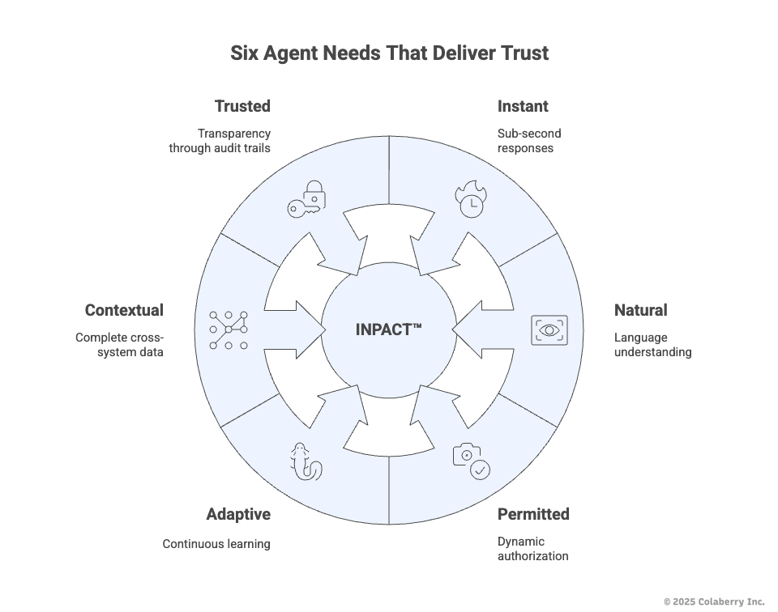

# Chapter 0: Why Agent-Ready Data? The INPACT™ Framework

**Book:** Enterprise Data Readiness for AI Agents  
**Subtitle:** A 90-Day Roadmap from Data Chaos to Agent-Ready Infrastructure  
**Author:** Ram Katamaraja, CEO of Colaberry Inc.  
**Publisher:** Colaberry Press  
**Version:** 3.1.0 (INPACT™ Framework Edition)  
**Publication Date:** October 23, 2025

---

**Reading Time:** ~35 minutes  
**Target Audience:** CDOs, CTOs, Data Architects, Business Leaders  
**Prerequisites:** None (introductory chapter)  
**Key Takeaway:** Understanding the INPACT™ framework—six agent needs that separate the 5% who succeed from the 95% who fail

---

## Table of Contents

- [The $40 Billion Trust Paradox](#the-40-billion-trust-paradox)
- [The Fundamental Shift: Human Needs to Agent Needs](#the-fundamental-shift-human-needs-to-agent-needs)
- [The INPACT™ Framework](#the-inpact-framework)
- [Understanding Needs vs. Capabilities](#understanding-needs-vs-capabilities)
- [The 6 Agent Needs: INPACT™](#the-6-agent-needs-inpact)
  - [I - Instant: Speed Builds Confidence](#i--instant-speed-builds-confidence)
  - [N - Natural: Understanding Builds Connection](#n--natural-understanding-builds-connection)
  - [P - Permitted: Security Builds Safety](#p--permitted-security-builds-safety)
  - [A - Adaptive: Improvement Builds Reliability](#a--adaptive-improvement-builds-reliability)
  - [C - Contextual: Completeness Builds Accuracy](#c--contextual-completeness-builds-accuracy)
  - [T - Trusted: Transparency Builds Confidence](#t--trusted-transparency-builds-confidence)
- [Bringing It Together](#bringing-it-together-the-6-agent-needs--capabilities--architecture)
- [Summary: The Path Forward](#summary-the-path-forward)
- [References and Citations](#references-and-citations)

---

## The $40 Billion Trust Paradox

In July 2025, MIT's NANDA initiative released a sobering report. After analyzing over 300 enterprise AI initiatives, interviewing 52 executives, and surveying 153 leaders, the researchers uncovered a stark reality: **95% of enterprise generative AI pilots fail to deliver measurable business value.**[1]

Despite $30-40 billion in investment, only 5% of organizations successfully translate AI pilots into production systems with real financial impact. The study revealed a "GenAI Divide"—a widening gap between companies achieving success and the vast majority stuck in failed experiments.

Here's what's puzzling: AI agents are more accurate than ever. Models like Claude Sonnet 4 and GPT-4 achieve superhuman performance on many tasks. Yet pilots keep failing.

**The answer lies in trust, not technology.**

Users abandon agents they can't understand—regardless of technical sophistication. July 2025 research confirms what practitioners already know: transparency and design are the mediators of trust.[2] When users can't see how agents make decisions, research shows distrust commonly spreads to both the AI and the company behind it.[3] Technical excellence means nothing without earned trust.

The primary reasons for failure weren't what most expected. Not model quality. Not regulation. Not talent shortage. The core barriers were poor data foundation accounting for 30% of failures, AI treated as an add-on rather than embedded in workflows, focus on flashy demos instead of measurable automation, and building generic solutions internally instead of adopting proven approaches.

MIT's recommendation was clear: *"Create a strong data foundation. Prioritize long-term strategy over hype."*[1]

**This chapter shows you exactly what that foundation looks like—starting with understanding the six needs agents must have to earn trust.**

---

## The Fundamental Shift: Human Needs to Agent Needs


**Diagram 1: Human Era → Agent Era Shift** - The fundamental change isn't the technology. It's whose needs we optimize for.

For three decades, enterprise data architecture optimized for **human needs**—building systems that put information in front of people who make decisions. Humans needed historical context to analyze trends, visual dashboards to spot patterns, time to think before acting, and control over every decision.

We built brilliant infrastructure for these needs across multiple technology eras: the Analytics Era brought data warehouses, ETL pipelines, and OLAP cubes in the 1990s-2000s; the Big Data Era introduced Hadoop clusters, data lakes, and distributed processing with Spark in the 2010s; the ML Era added feature stores, model training pipelines, and real-time predictions in the late 2010s-early 2020s; and the Data Mesh Era pioneered domain ownership, data products, and federated governance in the 2020s.

Dr. Sarah Cedao's Echo Health Systems in Boston had invested in all of these progressions over fifteen years—a pristine SQL Server warehouse from the Analytics Era, Azure data lake from the Big Data Era, Databricks for ML workloads, strong governance throughout, and awards for data excellence at each stage.

**Then came agents.**

---

## The INPACT™ Framework

### The Tony Robbins Parallel

Tony Robbins built an empire on one insight: humans have six core needs—certainty, variety, significance, connection, growth, and contribution.[6]

When these needs are fulfilled, humans flourish. When they're not, people stagnate.

**AI agents are no different.**

They don't need psychological fulfillment. They need architectural fulfillment. And when their six needs go unmet, they fail at the same 95% rate.

This is the **INPACT™ Framework**: the six agent needs that separate success from failure.

### Trust is the Outcome—INPACT™ Delivers It

Ask any CDO deploying agents: "What's your biggest concern?"

"Will users trust it?"

Trust isn't optional. It's the line separating the 5% who succeed from the 95% who fail. But trust isn't something you declare—it's something you earn through architecture that consistently delivers six essential capabilities.

**That's INPACT™: the framework for building agents users trust.**

The acronym is **INPACT™** (sounds like "impact"), and every letter represents an essential need:



- **I** – Instant (sub-second responses)
- **N** – Natural (language understanding)
- **P** – Permitted (dynamic authorization)
- **A** – Adaptive (continuous learning)
- **C** – Contextual (complete cross-system data)
- **T** – Trusted (transparency through audit trails)

**Mnemonic:** "Agents must be Instant, Natural, Permitted, Adaptive, Contextual, and Trusted—addressing each need systematically to earn trust consistently."

All six needs are required. Analysis suggests that addressing all six needs systematically is associated with higher success rates in building agents users trust. Organizations that miss even one face significantly higher risk of joining the 95% who fail.

When Echo's CEO asked Dr. Cedao "Can we deploy an agent for patient scheduling by Q3?", her Human Era infrastructure—sophisticated as it was—couldn't deliver on a single INPACT™ need.

**This chapter maps those 6 agent needs to the infrastructure capabilities required to meet them.**

---

## Understanding Needs vs. Capabilities

Before we dive into the six needs, let's clarify the relationship:

**The 6 AGENT NEEDS (INPACT™)** = What agents must have to succeed (business outcomes)  
**INFRASTRUCTURE CAPABILITIES** = What your data systems must deliver to meet those needs (technical mechanisms)

**Think of it this way:**

A patient **needs** rapid diagnosis. A hospital's **capability** to deliver that need is an advanced imaging center with 24/7 radiology.

An agent **needs** instant answers. An infrastructure **capability** to deliver that need is sub-second response architecture with real-time streaming and optimized storage.

**The six needs follow this pattern:**

```
Agent Need (outcome) → Infrastructure Capability (mechanism) → Architecture (implementation)
```

**Chapter 0 establishes the INPACT™ needs and capabilities.**  
**Chapter 1 shows the 7-layer architecture that delivers them.**  
**Chapters 6-8 provide the 90-day roadmap to build it.**

Now let's examine each of the 6 agent needs in the INPACT™ framework.

---

## The 6 Agent Needs: INPACT™


**Diagram 2: The INPACT™ Framework—6 Agent Needs → Infrastructure Capabilities**

Each need-capability pair is backed by quantitative research and proven implementations. Let's examine them.

---

## I – Instant: Speed Builds Confidence

### The Need: Sub-Second Responses

When a patient asks Echo's scheduling agent "Can I see Dr. Martinez today?", they expect an answer in seconds—not minutes, not hours. They've been trained by ChatGPT, Alexa, and Siri to expect conversational speed.

Dr. Cedao's first agent prototype took 8-13 seconds to respond. Patients abandoned the interaction before hearing the answer.

**This isn't about impatience. It's about trust.**

The speed imperative is clear: 90% of customers expect instant responses when reaching out with service queries,[7a] 61% prefer faster replies from AI over waiting for a human—speed now trumps human interaction,[7b] and 60% define "immediate" as 10 minutes or less.[7a]

Every second of latency costs trust. When a patient calls to schedule an appointment, the agent queries last night's data dump. The cancellation that happened 30 seconds ago? Invisible. The agent books a slot that's already gone. The patient calls back, frustrated. Trust evaporates.


**Diagram 3: Analytics Era Batch vs. Agent Era Real-Time Response**

### The Infrastructure Capability: Sub-Second Response Architecture

Delivering instant answers requires **sub-second response architecture**—an infrastructure capability that human-era systems weren't designed to provide. This capability comprises real-time data streams with Change Data Capture maintaining under 30 second freshness, storage optimized per query type (vector databases achieving under 50ms semantic search, knowledge graphs handling relationship queries in under 200ms, RDBMS delivering transactional lookups in under 20ms), semantic caching with over 60% hit rates reducing latency from seconds to milliseconds, and parallel processing enabling multi-agent orchestration where specialist agents work simultaneously rather than sequentially.

**Target SLOs:**
- Agent response time: <2 seconds for single queries, <3 seconds when coordinating multiple specialists
- Data freshness: <30 seconds for critical sources (appointments, inventory, eligibility)
- Infrastructure performance: Database queries <200ms, LLM inference 300-500ms

When this need is fulfilled, conversations flow. Trust builds with every accurate, instant response.

---

### Why Human Era Infrastructure Falls Short

**Echo's specific gaps:**

When their agent needed to respond to "Can I see Dr. Martinez today?", Dr. Cedao's team traced the execution chain. Parsing the query took 100ms—fast enough. Resolving "Dr. Martinez" to a provider_id took 200ms—acceptable. But then came the killer: querying appointment availability took 5-8 seconds because their `appointment_slots` table was refreshed nightly at 2 AM via batch ETL:

```sql
-- The overnight ETL that killed agent responsiveness
INSERT INTO warehouse.appointment_slots
SELECT provider_id, slot_datetime, is_available
FROM source_ehr.schedule
WHERE load_date = DATEADD(day, -1, GETDATE());
```

By 10 AM, the data was already 8 hours stale. That morning cancellation at 9:47 AM? The agent couldn't see it. The database was cold—no indexes optimized for this query pattern, no caching layer. Every request hit the warehouse fresh, forcing full table scans. Insurance eligibility checks added another 3-4 seconds of batch system lag. Scheduling rule application took 500ms (acceptable), and response generation took 400ms (acceptable).

**Total: 9-13 seconds. Complete failure. Users abandoned before hearing the answer.**

Your enterprise data systems were built for patience. Overnight batch jobs. Queries that take 9-13 seconds. Data that's hours or days old. That worked when humans analyzed reports over coffee. It fails when agents must respond at conversation speed.

---

### The Bridge to Architecture

Chapter 1 details how the seven architectural layers work together to deliver sub-second response capability, with Layer 1 eliminating data staleness through continuous streaming, Layer 4 implementing semantic caching and optimized retrieval, Layer 3 providing query-optimized databases, and Layer 7 enabling parallel multi-agent processing. Together, these layers achieved Echo's transformation from 9-13 second responses to 1.8 seconds average.

---

## N – Natural: Understanding Builds Connection

### The Need: Language Understanding

A care coordinator asks: "Show me patients needing diabetes follow-up this quarter."

Your agent thinks: "What is table FCT_PTNT_ENCT?"

Users don't speak SQL. They ask questions in natural language. Agents must understand these queries without requiring users to know table names, join logic, or data warehouse schemas.

When Dr. Cedao tried to build Echo's scheduling agent, she discovered a fundamental problem: **the agent couldn't map natural language to their data structures.**

"Dr. Martinez" existed as `primary_care_provider_id` in the EHR, `physician_npi` in the credentialing system, and `provider_schedule_id` in the scheduling database. The agent had no way to know these three identifiers represented the same person. It couldn't resolve "my doctor" to a specific provider. It couldn't understand "today" in the context of timezone-aware scheduling rules.

**Research quantifies the accuracy problem:**

**Baseline Performance:** Text-to-SQL accuracy on academic benchmarks like Spider shows 60-70% accuracy.[8] But enterprise schemas with hundreds of cryptically-named tables dramatically increase difficulty—many organizations see 40-60% accuracy in early testing without optimization.

**Target SLO with Semantic Optimization:** With semantic layer implementation, accuracy improves to 75-85%+.[9] However, most enterprises haven't invested in that infrastructure.

**A 40% failure rate is unacceptable** for healthcare, finance, or any domain where incorrect answers cause real harm.


**Diagram 4: Analytics Era Manual Translation vs. Agent Era Semantic Understanding**

### The Infrastructure Capability: Semantic Understanding

Delivering natural conversation requires **semantic understanding**—an infrastructure capability that translates between human language and data structures. This capability comprises business glossaries with natural language mappings (where "customer" maps to specific tables, fields, and relationships, and "high-risk patient" links to formal definitions using diagnosis codes, HbA1c thresholds, and readmission history), entity resolution across systems (where "Dr. Martinez" resolves to a canonical provider_npi linking the EHR's primary_care_provider_id, the credentialing system's physician_npi, and the scheduling database's provider_schedule_id), metric definitions with embedded business logic (where "revenue" includes specific GL codes, currency conversions, and fiscal calendar rules, all versioned to track evolution over time), and ontologies defining relationships through hierarchies, taxonomies, and semantic connections like "reports to" or "prescribed by."

When this need is fulfilled, semantic layers map natural language to data automatically. Business glossaries define terms once. "Diabetes follow-up" connects to diagnosis codes, HbA1c thresholds, and scheduling logic instantly. With semantic optimization, accuracy reaches the 85%+ target range. Conversations become natural. Coordinators ask questions; agents understand.

---

### Why Human Era Infrastructure Falls Short

**Echo's specific gaps:**

Their SQL Server warehouse revealed the mismatch between Analytics Era design and Agent Era requirements. The warehouse contained 487 tables with cryptic names like `FCT_PTNT_ENCT` (fact_patient_encounter), `DIM_PRVDR_SPCLT` (dimension_provider_specialty), and `BRIDGE_PTNT_PRVDR_RLTNSHP` (bridge table for patient-provider relationships). Documentation was 18 months out of date, stored in SharePoint and rarely updated. No system connected natural language concepts to technical artifacts. "Dr. Martinez" existed as separate identifiers in three systems with no linkage.

**The Azure data lake had even less structure:**

Files were named generically: `epic_extract_20240315.parquet`, `claims_dump_2024Q1.csv`, `patient_notes_raw/2024/03/`. There was no schema documentation, no business glossary, and no natural language mappings.

**The resulting workflow for each new query type required:**

Developers needed to understand clinical definitions (not documented) taking 2-3 days, find which tables contained relevant data (required tribal knowledge) taking 1-2 days, figure out undocumented join logic taking 2-3 days, and translate business rules into SQL (error-prone and slow) taking 3-5 days.

**Total: 2-3 weeks per query type, requiring developer intervention every time.**

Your data warehouse has 487 tables with names like FCT_PTNT_ENCT and DIM_PRVDR_SPCLT. Documentation is 18 months out of date. The three engineers who understand it are in back-to-back meetings. Agents don't have tribal knowledge. They can't guess. Four out of ten queries fail silently, returning nothing or—worse—returning the wrong patients.

---

### The Bridge to Architecture

Chapter 1 shows how the semantic layer (Layer 2) provides business glossaries and entity resolution, how the RAG infrastructure (Layer 4) uses embedding models to encode semantic meaning beyond keywords, and how vector databases (Layer 3) enable concept similarity queries. These components working together allow agents to understand "patients needing diabetes follow-up" and translate it accurately to database queries without developer intervention.

---

## P – Permitted: Security Builds Safety

### The Need: Dynamic Authorization

One agent. Three users. Three completely different permission requirements.

A physician asks: "Show me today's patient appointments." They should see all 200 appointments across the clinic.

A patient asks: "Show me my appointments." They should see only their own.

An administrator asks: "Show me appointment statistics." They should see aggregate numbers, not individual patient names.

The agent needs to enforce the right permissions in milliseconds, every single time—or you're facing HIPAA violations.

The same agent serves different users with different permissions. Traditional role-based access control (RBAC) breaks down completely for agents.

When Dr. Cedao's team built their first agent, they gave it a service account with broad database permissions. This created an immediate compliance crisis: the agent could access any patient's PHI regardless of who was asking, violating HIPAA's minimum necessary standard. When they tried to restrict permissions, the agent couldn't function—it needed different access rights for different queries from different users.


**Diagram 6: Analytics Era Static RBAC vs. Agent Era Dynamic ABAC**

### The Infrastructure Capability: Dynamic Authorization

Your current approach doesn't work. Most organizations give the agent a single "service account" with broad database permissions, then add custom code to filter results. This creates two critical problems:

First, **compliance violations**. HIPAA and GDPR require dynamic access control with audit trails showing who accessed what data, when, and why.[10] A service account accessing everything on behalf of different users doesn't meet this standard. When auditors ask "Who saw patient 12345's records?", you can't answer.

Second, **it doesn't scale**. Adding role-based rules for every combination creates what NIST calls "role explosion."[11] A system with just 10 attributes requires over 1,000 roles. Developers spend more time managing permission logic than building features.

Delivering personalized access requires **dynamic authorization**—an infrastructure capability that evaluates permissions at query time based on user attributes, data attributes, environmental context, and intended use. Modern attribute-based access control (ABAC) solves this by evaluating permissions dynamically in real-time. As Rippling's 2025 analysis explains, ABAC is particularly well-suited for dynamic environments where user responsibilities and resource classifications frequently change, providing the flexibility and fine-grained control that static RBAC cannot deliver.[11b]

This capability comprises attribute-based access control (ABAC) policies evaluated in real-time (where subject attributes include user role, clearance level, department, and employment status; object attributes include data classification, owner, sensitivity level, and geographic region; action attributes specify read, write, summarize, export, or delete operations; and environment attributes capture time of day, location, device type, and network zone), dynamic data masking that redacts sensitive fields based on the requester's permissions, real-time audit logging that captures every access decision with trace IDs, and compliance automation that enforces regulatory requirements like HIPAA's minimum necessary standard without manual intervention.

**Target SLO:**
- Authorization evaluation: <10 milliseconds per query
- Every access is audited with full provenance: user identity, accessed resources, applied policies, and business justification

When this need is fulfilled, dynamic access control evaluates permissions in real-time based on who's asking, what they're accessing, when, where, and why. This satisfies both HIPAA's audit requirements and GDPR's right to explanation.

---

### Why Human Era Infrastructure Falls Short

**Echo's specific gaps:**

Their SQL Server database used traditional role-based access (RBAC) defined at the database level. They had four roles: `db_reader` (read-only access to all tables), `db_writer` (write access to all tables), `db_admin` (full administrative privileges), and `app_service` (the role their applications used, with broad read permissions).

When Dr. Cedao's team gave their agent the `app_service` account, they immediately faced problems:

```sql
-- The service account that violated HIPAA
CREATE USER scheduling_agent WITH PASSWORD = 'SecureP@ssw0rd';
ALTER ROLE app_service ADD MEMBER scheduling_agent;

-- This grant was too broad for HIPAA compliance
GRANT SELECT ON warehouse.patients TO app_service;
GRANT SELECT ON warehouse.appointments TO app_service;
GRANT SELECT ON warehouse.clinical_notes TO app_service;
-- Agent could now access ANY patient's data, regardless of who asked
```

Your pilot agent uses one service account. A patient asks about their records. The agent queries the database successfully—but the audit log shows service_account accessed patient_table at 14:32:18. No user identity. No purpose. No data returned. When the breach happens (and it will), you can't prove who accessed what. HIPAA fines start at $50,000 per violation.

The first compliance audit failed catastrophically. The agent used one service account for all users, meaning permissions couldn't vary by requester. Role-based access operated at table level (grant all or nothing), not row level (grant only relevant records). Static permissions didn't consider context like time of day, location, or purpose of access. And there was no audit trail linking queries back to the actual human user who triggered them—logs showed only "scheduling_agent" made the query.

---

### The Bridge to Architecture

Chapter 1 details how Layer 5 implements ABAC governance with real-time policy engines evaluating permissions based on user attributes, data sensitivity, actions requested, and environmental context. It shows how dynamic masking redacts fields per-query without requiring custom code, how audit logging maintains HIPAA compliance with complete traceability, and how policy evaluation happens in under 10ms without breaking agent response time targets.

---

## A – Adaptive: Improvement Builds Reliability

### The Need: Continuous Learning

Agents aren't static. They improve from every interaction. When users correct mistakes, clarify ambiguities, or express dissatisfaction, that feedback should flow back to improve data quality, retrieval accuracy, model performance, and future responses.

When Dr. Cedao deployed Echo's first scheduling agent, she initially viewed it as "done" once launched. But within the first week, patterns emerged: the agent gave wrong answers about specialist availability 15% of the time, couldn't understand certain patient questions about insurance coverage, responded slowly during peak morning hours, and provided outdated information about clinic hours after a recent schedule change.

**The traditional approach would wait for quarterly reviews to address these issues. By then, thousands of patients would have poor experiences.**

Research shows that 91% of ML models degrade over time without continuous monitoring and retraining.[12] For agent systems, this degradation manifests as semantic drift (domain terminology evolves), retrieval quality decline (embedding models become stale), and data quality issues (source systems change without notification).


**Diagram 7: Analytics Era Periodic Reviews vs. Agent Era Continuous Learning**

### The Infrastructure Capability: Continuous Learning

Delivering always-improving performance requires **continuous learning**—an infrastructure capability that captures feedback from every interaction, diagnoses root causes automatically, and triggers improvements without manual intervention. 

This capability comprises real-time observability capturing both explicit feedback (thumbs up/down, "report issue" clicks, user corrections) and implicit signals (task completion rates, time-to-resolution, retry patterns, abandonment), automated root cause analysis using trace IDs to follow queries end-to-end through all architectural layers, feedback loops that automatically improve data quality when the agent gives wrong answers due to missing or incorrect source data, model retraining triggers when embedding models drift semantically or retrieval quality drops below thresholds, and continuous evaluation comparing production performance against baseline datasets to detect gradual degradation before users notice.[13a][13b]

**Target outcomes:**
- Detecting quality issues within hours (not weeks)
- Fixing data problems within 24 hours
- Deploying model improvements within 1-2 weeks
- Continuous accuracy improvement from initial baseline to 85%+ within 90 days

When this need is fulfilled, quality improves over time instead of degrading. Agents learn from mistakes, adapt to changing terminology, and become more reliable with every interaction.

---

### Why Human Era Infrastructure Falls Short

**Echo's specific gaps:**

Their analytics infrastructure was designed for retrospective analysis, not real-time feedback. When the agent gave wrong answers, they had no visibility into why. Application monitoring tracked server uptime and response times (server availability, API latency, error rates), but provided zero insight into agent-specific failures like retrieval quality, semantic misunderstandings, model drift, or data quality issues causing wrong answers.

When Dr. Cedao's team investigated why the agent was wrong about specialist availability 15% of the time, they discovered the painful diagnostic process:

```sql
-- The manual investigation that took 3 days to find the problem
-- Step 1: Find recent specialist queries (no trace IDs linking agent to DB)
SELECT query_text, timestamp, response_time
FROM application_logs
WHERE query_text LIKE '%specialist%'
AND timestamp > DATEADD(day, -7, GETDATE());
-- 1,247 queries returned... no way to identify which ones were wrong

-- Step 2: Manually test queries to see if results match reality
-- Had to call clinics to verify actual availability vs. what agent said
-- Took 2 days of manual phone verification

-- Step 3: Finally discovered the root cause
SELECT specialist_type, available_slots, last_updated
FROM warehouse.provider_schedules
WHERE specialty = 'Cardiology';
-- last_updated = 2024-10-15 (3 days ago!)
-- New cardiology wing opened 2 days ago, but CDC pipeline wasn't capturing it
```

The investigation revealed systemic problems. There were no trace IDs connecting user queries through semantic layer to database to response, making it impossible to debug failures automatically. No quality metrics for agent performance—they didn't measure retrieval accuracy, semantic understanding, or hallucination rates. No model drift detection for their embedding models—semantic drift occurred as medical terminology evolved, but they had no alerts. And no automated feedback loops—every improvement required manual investigation taking days or weeks.

**Result: The agent improved slowly, linearly, and painfully—while users abandoned it faster than the team could fix problems.**

---

### The Bridge to Architecture

Chapter 1 details how Layer 6 implements observability with comprehensive telemetry capturing both data quality and model performance metrics. It shows how trace IDs enable automated root cause analysis connecting user queries through all seven layers to pinpoint failure sources. It explains how feedback loops automatically trigger data quality fixes when agent errors stem from source data problems, and how model drift detection triggers retraining cycles when embedding quality degrades.

---

## C – Contextual: Completeness Builds Accuracy

### The Need: Complete Cross-System Context

Real questions span multiple data sources. A patient asking "Am I eligible for the diabetes care program?" needs the agent to check diagnosis codes from the EHR, lab results showing HbA1c levels, insurance coverage from the claims system, current program enrollments from care management, and behavioral health considerations from provider notes—all in real-time.

No single system has the complete answer.

When Dr. Cedao's team built their first agent, they quickly hit this wall. The agent could query one system at a time, but assembling context across systems required custom integration code for every new question type.

Each new data source adds integration complexity that grows exponentially, not linearly. Traditional point-to-point integrations create a maintenance nightmare where N data sources require N(N-1)/2 integration points.


**Diagram 5: Analytics Era Siloed Data vs. Agent Era Unified Context**

### The Infrastructure Capability: Cross-Domain Integration

Delivering complete context requires **cross-domain integration**—an infrastructure capability that unifies data from multiple systems while maintaining real-time freshness. 

This capability comprises real-time data fabric with Change Data Capture from all source systems (streaming updates rather than batch exports, maintaining sub-minute latency across domains), unified entity resolution across domains (where "patient MRN 12345" in the EHR, "member ID 789" in claims, "user account 456" in the patient portal, and "care plan participant 321" in care management all resolve to a single canonical patient identity), multi-modal storage optimized for different query patterns (vector databases for semantic search of clinical notes, knowledge graphs for relationship queries across departments, traditional RDBMS for transactional lookups, and data warehouses for analytical aggregations), and RAG infrastructure that intelligently retrieves and assembles relevant context from the right storage layers based on query requirements.

**Target outcomes:**
- Assembling context from 5-10 source systems in under 2 seconds
- 95%+ entity resolution accuracy
- Real-time freshness across all integrated systems

When this need is fulfilled, answers are complete and accurate across all relevant systems. Users receive comprehensive information without knowing which underlying systems were queried.

---

### Why Human Era Infrastructure Falls Short

**Echo's specific gaps:**

Their data architecture reflected decades of system acquisitions and organic growth. Clinical data lived in Epic EHR with nightly extracts to the warehouse. Claims data came from their insurance processor through weekly batch files. Patient portal data sat in a separate MongoDB instance with no integration. Care management tracked enrollments in Salesforce Health Cloud. Lab results were in a standalone LIMS system. Scheduling lived in a different Epic module with its own database.

When Dr. Cedao's team tried to answer "Is this patient eligible for the diabetes program?", they discovered the painful reality:

```sql
-- The JOIN nightmare that broke cross-domain queries
SELECT 
    p.patient_id,
    p.patient_name,
    dx.diagnosis_code,        -- Epic EHR (updated nightly)
    lab.hba1c_result,          -- LIMS (updated weekly)
    ins.coverage_status,       -- Claims DB (updated weekly)
    portal.engagement_score,   -- MongoDB (no SQL access)
    cm.current_programs        -- Salesforce (API only)
FROM warehouse.patients p
LEFT JOIN warehouse.diagnoses dx ON p.patient_id = dx.patient_id
LEFT JOIN warehouse.lab_results lab ON p.patient_id = lab.patient_id
LEFT JOIN warehouse.insurance ins ON p.member_id = ins.member_id  -- Different ID!
-- Portal data: manual export required
-- Salesforce data: separate API call required
WHERE dx.diagnosis_code LIKE 'E11%'  -- Diabetes codes
AND lab.hba1c_result > 7.0
AND ins.coverage_status = 'ACTIVE';
```

The query couldn't even execute properly because patient portal engagement scores weren't in SQL (NoSQL database requiring separate query), care management enrollments required Salesforce API calls (not accessible via SQL joins), and entity IDs didn't match across systems (patient_id in EHR didn't equal member_id in insurance). Data freshness varied wildly: EHR data was 8-24 hours old, claims data was up to 7 days old, lab results could be 14 days stale, and real-time patient portal activity wasn't available at all.

**Result: The agent couldn't assemble complete context. Eligibility checks required 4-6 minutes of sequential system queries and manual data reconciliation.**

---

### The Bridge to Architecture

Chapter 1 details how Layer 1's real-time data fabric streams changes continuously from all sources, how Layer 2's semantic layer provides unified entity resolution across domains, how Layer 3's multi-modal storage optimizes for different query patterns, and how Layer 4's RAG infrastructure intelligently retrieves and assembles context. These layers working together enable agents to assemble complete context from multiple systems in under 2 seconds.

---

## T – Trusted: Transparency Builds Confidence

### The Need: Explainable Decisions

"How did the agent decide that?" must have a clear, auditable answer.

When Dr. Cedao's first agent approved a patient for the diabetes care program, the care coordinator asked a reasonable question: "Why was this patient approved?" The agent had no answer. The coordinator couldn't see which data the agent considered, which business rules it applied, or why it reached that conclusion.

**For regulated industries like healthcare and finance, this isn't just inconvenient—it's a compliance failure.**

HIPAA requires complete audit trails for all PHI access. GDPR requires explanations for automated decisions. When Echo's compliance officer reviewed their agent audit logs, she found only:

```
2024-10-15 14:32:18 - User: scheduling_agent - Action: SELECT - Table: patients - Result: Success
```

This log entry was worthless for compliance. It didn't show which human user triggered the query, what question they asked, which specific patient records were accessed, what the agent's answer was, or what business rules led to that decision.

Research confirms that transparency and design are the mediators of trust in AI systems.[2] When users can't see how agents make decisions, distrust spreads to both the AI and the company behind it.[3]


**Diagram 8: Analytics Era Manual Audits vs. Agent Era Automated Traceability**

### The Infrastructure Capability: Auditability & Explainability

Delivering trustworthy decisions requires **auditability and explainability**—an infrastructure capability that captures every decision with complete provenance and provides human-readable explanations of reasoning.

This capability comprises comprehensive audit logging capturing who (user identity, role, session context), what (data accessed, query executed, results returned), when (timestamp with timezone), why (business purpose, policy justification), and how (trace ID linking through all architectural layers), data lineage tracking showing where information originated (which source systems, when last updated, what transformations applied, what confidence scores), decision explainability providing citations for agent responses (which documents were retrieved, what confidence scores, which business rules applied, what alternative interpretations were considered), and compliance automation ensuring HIPAA, GDPR requirements are met without manual effort (audit logs are immutable using write-once storage, retention matches regulatory requirements, and access to audit logs themselves is governed by ABAC).[10][17]

**Target outcomes:**
- 100% query traceability
- Audit log completeness meeting HIPAA standards
- Explanations linking back to source data with confidence scores
- Audit queries responding in under 100ms for real-time compliance dashboards

When this need is fulfilled, every decision is traceable, reproducible, and auditable. Users understand how agents reach conclusions, and compliance teams can demonstrate regulatory adherence on demand.

---

### Why Human Era Infrastructure Falls Short

**Echo's specific gaps:**

Their SQL Server transaction logs captured database operations, but provided no business context. The logs showed which tables were queried and when, but not why—what question the user asked, what the agent answered, or how it reached that conclusion.

When the compliance officer asked for an audit trail showing "all patients whose diabetes data was accessed by Dr. Cedao's team in September 2024", the DBA ran this query:

```sql
-- The audit query that took 4 hours and provided useless results
SELECT 
    timestamp,
    username,
    table_name,
    operation_type,
    affected_rows
FROM sys.fn_dblog(NULL, NULL)  -- SQL Server transaction log
WHERE table_name IN ('patients', 'diagnoses', 'lab_results')
AND timestamp BETWEEN '2024-09-01' AND '2024-09-30'
AND username = 'scheduling_agent';
-- Returned 847,392 log entries... but no business context
```

The results were technically complete but operationally worthless. Every entry showed "scheduling_agent" as the user (not the actual human who triggered the query), operations were database-level (INSERT, UPDATE, SELECT) not business-level (approved for program, checked eligibility), no query text was preserved (couldn't see what question was asked), no response data was logged (couldn't see what answer the agent gave), and no trace IDs linked related operations (couldn't connect a user's question through semantic layer, retrieval, to database query).

**Result: The agent had to be taken offline until comprehensive audit infrastructure could be built—6 weeks of lost productivity and damaged user trust.**

---

### The Bridge to Architecture

Chapter 1 details how Layer 5 implements comprehensive audit logging with business context, capturing not just database operations but the user's natural language question, the agent's answer, which data was accessed, what policies were applied, and why. It shows how trace IDs connect every query through all seven layers, enabling root cause analysis and compliance reporting. It explains how Layer 4's RAG infrastructure provides citation mechanisms linking responses to source documents with confidence scores, and how Layer 2's semantic layer maintains data lineage showing where information originated and when it was last updated.

---

## Bringing It Together: The 6 Agent Needs → Capabilities → Architecture

We've examined six fundamental agent needs in the INPACT™ framework and the infrastructure capabilities required to meet them. Let's map how these connect to the seven-layer architecture you'll see in Chapter 1:

| INPACT™ Need | Infrastructure Capability | Primary Architecture Layers |
|--------------|--------------------------|----------------------------|
| **I - Instant** | Sub-Second Response Architecture | Layer 1 (Real-Time Fabric)<br>Layer 3 (Query-Optimized Storage)<br>Layer 4 (Semantic Caching)<br>Layer 7 (Parallel Multi-Agent) |
| **N - Natural** | Semantic Understanding | Layer 2 (Semantic Layer)<br>Layer 4 (Embedding Models)<br>Layer 3 (Vector Databases) |
| **P - Permitted** | Dynamic Authorization | Layer 5 (ABAC Governance)<br>Layer 6 (Audit Logging) |
| **A - Adaptive** | Continuous Learning | Layer 6 (Observability & Feedback)<br>Layer 1 (Fresh Training Data)<br>Layer 4 (Retrieval Quality Metrics) |
| **C - Contextual** | Cross-Domain Integration | Layer 1 (Real-Time Fabric)<br>Layer 2 (Entity Resolution)<br>Layer 3 (Multi-Modal Storage)<br>Layer 4 (RAG Infrastructure) |
| **T - Trusted** | Auditability & Explainability | Layer 5 (Comprehensive Audit Logs)<br>Layer 6 (Trace IDs & Lineage)<br>Layer 4 (Citation & Confidence)<br>Layer 2 (Data Provenance) |

**The pattern is clear:** No single layer solves any need. All six needs require multiple layers working together as an integrated system.

**This is why bolt-on approaches fail.** You can't just add a vector database and call it "agent-ready." You can't deploy an LLM on top of your data warehouse and expect instant answers. You can't implement RBAC policies and claim dynamic authorization.

**Agent-ready data infrastructure requires fundamental architectural transformation across all seven layers:**

1. **Layer 1: Real-Time Data Fabric** - Streaming data with sub-30-second freshness, replacing batch ETL
2. **Layer 2: Unified Semantic Layer** - Business glossaries and entity resolution, replacing cryptic schemas
3. **Layer 3: Multi-Modal Storage** - Query-optimized databases, replacing one-size-fits-all warehouses
4. **Layer 4: Intelligent Retrieval (RAG)** - Semantic search and caching, replacing generic SQL
5. **Layer 5: Agent-Aware Governance** - ABAC and audit logging, replacing static RBAC
6. **Layer 6: Observability & Feedback** - Continuous monitoring and improvement, replacing quarterly reviews
7. **Layer 7: Data Products & Multi-Agent Orchestration** - Self-service APIs and parallel processing, replacing manual provisioning

**Chapter 1 shows you exactly how these seven layers work together.** Chapters 6-8 provide the 90-day roadmap to build them.

---

## Summary: The Path Forward

### What You've Learned

**The Problem:** 95% of enterprise AI pilots fail, primarily due to poor data foundation. The answer lies in trust, not technology. Analytics Era infrastructure—sophisticated as it is for human decision-making—cannot meet the six fundamental needs agents have to earn user trust.

**The INPACT™ Framework:** Just as Tony Robbins identified six human needs for fulfillment, analysis reveals six architectural needs agents must have to earn trust:

1. **I - Instant** - Sub-2-second responses (not 9-13 seconds)
2. **N - Natural** - 75-85%+ query understanding with semantic layers (not 40-60%)
3. **P - Permitted** - Dynamic ABAC authorization (not static RBAC)
4. **A - Adaptive** - Continuous learning loops (not quarterly reviews)
5. **C - Contextual** - Real-time cross-domain integration (not weekly batch)
6. **T - Trusted** - Complete audit trails with explainability (not cryptic logs)

**The Infrastructure Capabilities:** Each agent need maps to specific technical capabilities your data systems must deliver: sub-second response architecture, semantic understanding, dynamic authorization, continuous learning, cross-domain integration, and auditability with explainability.

**The Architecture:** Chapter 1 shows how the seven-layer architecture delivers these capabilities. Chapters 6-8 provide the 90-day roadmap to build it.

### The Echo Health Story

Dr. Sarah Cedao's Echo Health Systems in Boston started exactly where you might be today: pristine SQL Server warehouse, Azure data lake, Databricks for ML workloads, strong governance, awards for data excellence. Fifteen years of progressive investment in Analytics Era infrastructure.

But when her CEO asked "Can we deploy an agent for patient scheduling by Q3?", that infrastructure couldn't deliver on a single INPACT™ need. Overnight ETL created 8-24 hour data staleness. Cryptic table names prevented natural language understanding. Siloed systems blocked cross-domain context. Static RBAC violated HIPAA. No feedback loops meant slow improvement. Incomplete audit logs failed compliance.

**The journey from 9-13 second responses to 1.8 seconds average, from 40-60% query accuracy to 85%+, from compliance failure to HIPAA exemplar, required transforming all seven architectural layers.**

Chapter 1 shows you exactly how.

---

### What's Next

**Chapter 1: The 7-Layer Agent-Ready Data Architecture** - The complete technical framework that delivers all six INPACT™ capabilities

**Chapters 2-5: Strategic Foundation**
- Chapter 2: The Five Pillars (expanded fundamentals)
- Chapter 3: Acceleration Playbook (fast-start strategies)  
- Chapter 4: Gap Assessment (where are you today?)
- Chapter 5: Building the Business Case (quantified ROI)

**Chapters 6-8: 90-Day Implementation Roadmap**
- Chapter 6: Phase 1 - Quick Wins (Days 1-30)
- Chapter 7: Phase 2 - Scale Infrastructure (Days 31-60)
- Chapter 8: Phase 3 - Production Ready (Days 61-90)

**Chapters 9-12: Operational Excellence**
- Chapter 9: Governance & Compliance
- Chapter 10: RAG Architecture Best Practices
- Chapter 11: Multi-Agent Orchestration Patterns
- Chapter 12: Security & Threat Modeling

**Chapters 13-16: Industry-Specific Guides**
- Chapter 13: Healthcare Implementation
- Chapter 14: Financial Services Implementation
- Chapter 15: Retail & E-Commerce Implementation
- Chapter 16: Manufacturing & Supply Chain Implementation

**Turn the page. Let's build INPACT™-ready data infrastructure together.**

---

## References and Citations

[1] Challapally, A., Pease, C., Raskar, R., & Chari, P. (2025, July). "The GenAI Divide: State of AI in Business 2025." MIT NANDA (Networked Agents and Decentralized AI). https://mlq.ai/media/quarterly_decks/v0.1_State_of_AI_in_Business_2025_Report.pdf

[2] ScienceDirect (July 2025). "The Key Role of Design and Transparency in Enhancing Trust in AI-Powered Digital Agents." Journal of Innovation & Knowledge. https://www.sciencedirect.com/science/article/pii/S2444569X25001155

[3] Park, K., Yoon, H.Y. (July 2025). "AI Algorithm Transparency, Pipelines for Trust Not Prisms: Mitigating General Negative Attitudes and Enhancing Trust Toward AI." Humanities and Social Sciences Communications, Nature. https://www.nature.com/articles/s41599-025-05116-z

[6] Robbins, T. "The 6 Human Needs: Why We Do What We Do." https://www.tonyrobbins.com/mind-meaning/do-you-need-to-feel-significant/

[7a] HubSpot Research (2024). "State of Service Report 2024." Statistics on customer expectations for instant responses and resolution timeframes. https://blog.hubspot.com/service/state-of-service-report

[7b] Intercom (2024). "Customer Service Trends Report 2024." 61% of consumers prefer faster AI replies over waiting for human representatives. https://downloads.ctfassets.net/xny2w179f4ki/3FxNFG5dIUBgphM6xqLgPy/ecfaca62ff0550e4d345b31addbff762/Intercom_Customer_Service_Trends_Report_2024.pdf

[8] Spider Benchmark. Yu, T., et al. (2018). "Spider: A Large-Scale Human-Labeled Dataset for Complex and Cross-Domain Semantic Parsing and Text-to-SQL Task." Yale University. https://yale-lily.github.io/spider

[9] Databricks (2024). "Improving Text2SQL Performance with Ease on Databricks." https://www.databricks.com/blog/improving-text2sql-performance-ease-databricks

[10] HIPAA Security Rule. U.S. Department of Health & Human Services. 45 CFR § 164.312(b). https://www.law.cornell.edu/cfr/text/45/164.312

[11] NIST Special Publication 800-162 (2014). "Guide to Attribute Based Access Control (ABAC)." https://nvlpubs.nist.gov/nistpubs/specialpublications/nist.sp.800-162.pdf

[11b] Rippling (April 2025). "Attribute-Based Access Control (ABAC): A Guide." Analysis of ABAC for dynamic environments and fine-grained authorization. https://www.rippling.com/blog/attribute-based-access-control

[12] NannyML (2024). "91% of ML Models Degrade in Time: MIT Paper Review." January 19, 2024. https://www.nannyml.com/blog/91-of-ml-perfomance-degrade-in-time

[13a] Rohan Paul (June 2025). "Handling LLM Model Drift in Production: Monitoring, Retraining, and Continuous Learning." https://www.rohan-paul.com/p/ml-interview-q-series-handling-llm

[13b] NexaStack (July 2025). "Combating Model Drift with Proactive Infrastructure Design." https://www.nexastack.ai/blog/model-drift-infrastructure-design

[17] HIPAA Security Rule. 45 CFR § 164.312(b) - Audit Controls. https://www.law.cornell.edu/cfr/text/45/164.312

---

**End of Chapter 0**

**Author:** Ram Katamaraja, CEO of Colaberry Inc.  
**Publisher:** Colaberry Press  
**Copyright:** © 2025 Colaberry Inc.  
**Version:** 3.1.0 (INPACT™ Framework Edition)
