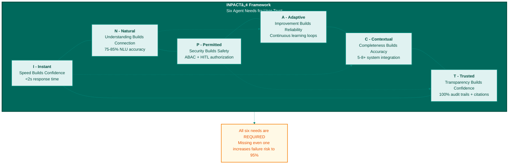

**Figure B.1: INPACTâ„¢ Six Agent Needs Framework**

The INPACT™ framework identifies six architectural requirements agents must fulfill to earn user trust. All six needs are interdependent—missing even one significantly increases the risk of joining the 95% of AI pilots that fail to achieve ROI.

---

© 2025 Colaberry Inc.
