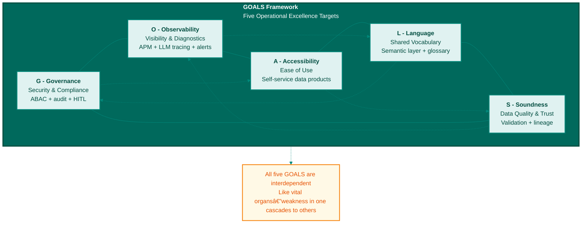

**Figure C.1: GOALS Operational Excellence Framework**

The GOALS framework defines five interdependent operational targets for maintaining agent-ready data infrastructure. Like vital organs in a body, each GOAL supports the others—weakness in one cascades throughout the system.

---

© 2025 Colaberry Inc.
