```mermaid
%%{init: {'theme':'base', 'themeVariables': { 'primaryColor':'#e0f2f1','primaryTextColor':'#004d40','primaryBorderColor':'#00897b','lineColor':'#00897b','secondaryColor':'#f0fff0','tertiaryColor':'#fff'}}}%%

graph TD
    INPACT["<b>INPACTâ„¢ Framework</b><br/>(Chapter 0)<br/><br/>What agents NEED<br/>6 trust requirements<br/>I-N-P-A-C-T"]
    
    ARCH["<b>7-Layer Architecture</b><br/>(Chapter 1)<br/><br/>What you BUILD<br/>Technical infrastructure<br/>L1 through L7"]
    
    GOALS["<b>GOALS Framework</b><br/>(Chapter 2)<br/><br/>What you MAINTAIN<br/>Operational excellence<br/>G-O-A-L-S"]
    
    ROADMAP["<b>90-Day Roadmap</b><br/>(Chapter 3)<br/><br/>HOW you implement<br/>Week-by-week execution<br/>Assessment → Build → Deploy"]
    
    INPACT -->|"Defines requirements for"| ARCH
    ARCH -->|"Must maintain via"| GOALS
    GOALS -->|"Executed through"| ROADMAP
    
    ROADMAP -.->|"Validates achievement of"| INPACT
    
    Note1["<b>The Complete Framework</b><br/>INPACTâ„¢ = destination (user trust)<br/>Architecture = vehicle (technical platform)<br/>GOALS = maintenance (operational discipline)<br/>Roadmap = journey (implementation path)"]
    
    ROADMAP -.-> Note1
    
    classDef framework fill:#e0f2f1,stroke:#00897b,stroke-width:3px,color:#004d40,font-weight:bold
    classDef note fill:#00695c,stroke:#004d40,stroke-width:2px,color:#ffffff
    
    class INPACT,ARCH,GOALS,ROADMAP framework
    class Note1 note
```

**Figure C.2: How the Three Frameworks Connect**

The book's frameworks work together as a complete system: INPACTâ„¢ defines what agents need (destination), 7-layer architecture specifies what you build (vehicle), GOALS establishes what you maintain (operational discipline), and the 90-day roadmap shows how to execute (journey). Each framework informs and validates the others.

---

© 2025 Colaberry Inc.
