```mermaid
%%{init: {'theme':'base', 'themeVariables': { 'primaryColor':'#e0f2f1','primaryTextColor':'#004d40','primaryBorderColor':'#00897b','lineColor':'#00897b','secondaryColor':'#f0fff0','tertiaryColor':'#fff'}}}%%

graph TD
    subgraph SCORING["<b>INPACT™ Scoring Guide</b><br/>Total: 6 needs × 6 points = 36 max"]
        HIGH["<b>30-36 Points</b><br/>HIGH TRUST<br/>Healthcare-ready<br/>Production-grade"]
        GOOD["<b>24-29 Points</b><br/>GOOD TRUST<br/>Enterprise-ready<br/>Most use cases"]
        MOD["<b>18-23 Points</b><br/>MODERATE TRUST<br/>Internal tools acceptable<br/>Not patient-facing"]
        LOW["<b>12-17 Points</b><br/>LOW TRUST<br/>Not recommended<br/>Needs improvement"]
        VLOW["<b>6-11 Points</b><br/>VERY LOW TRUST<br/>Not ready for deployment<br/>Major gaps"]
    end
    
    PER_NEED["<b>Per Need Scoring (1-6)</b><br/><br/>6 = Best-in-Class<br/>5 = Production-Ready<br/>4 = Acceptable<br/>3 = At Risk<br/>2 = Poor<br/>1 = Unacceptable"]
    
    SCORING --- PER_NEED
    
    DEPLOY["✅ Deploy to Production<br/>Patient-facing OK"]
    PILOT["âš ï¸ Internal Pilot Only<br/>Monitor closely"]
    STOP["⌠Do Not Deploy<br/>Address gaps first"]
    
    HIGH --> DEPLOY
    GOOD --> DEPLOY
    MOD --> PILOT
    LOW --> STOP
    VLOW --> STOP
    
    classDef green fill:#00695c,stroke:#004d40,stroke-width:3px,color:#ffffff,font-weight:bold
    classDef yellow fill:#fff9e6,stroke:#f57c00,stroke-width:3px,color:#e65100,font-weight:bold
    classDef red fill:#990000,stroke:#b71c1c,stroke-width:3px,color:#ffffff,font-weight:bold
    classDef neutral fill:#f9f9f9,stroke:#666666,stroke-width:2px,color:#000000
    classDef action fill:#e0f2f1,stroke:#00897b,stroke-width:2px,color:#004d40
    
    class HIGH,GOOD green
    class MOD yellow
    class LOW,VLOW red
    class PER_NEED,SCORING neutral
    class DEPLOY,PILOT,STOP action
```

**Figure B.2: INPACTâ„¢ Scoring Interpretation Guide**

INPACT™ scores range from 6 to 36 points (6 needs × 1-6 points each). Scores of 30-36 indicate High Trust suitable for production healthcare environments. Scores of 24-29 represent Good Trust for most enterprise use cases. Scores below 18 indicate the system is not ready for deployment and requires improvement.

---

© 2025 Colaberry Inc.
